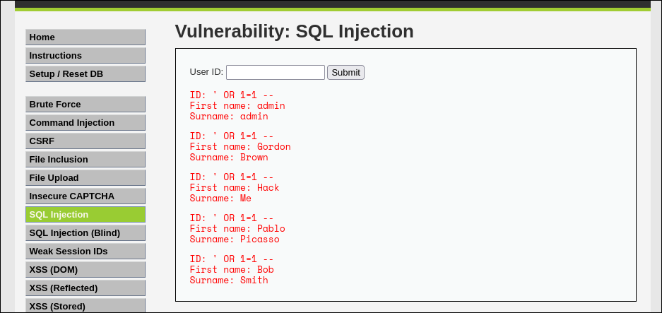
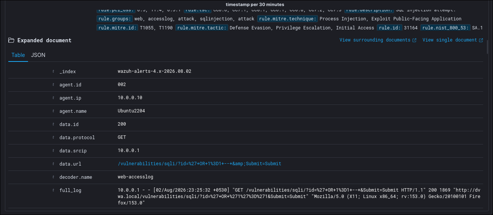
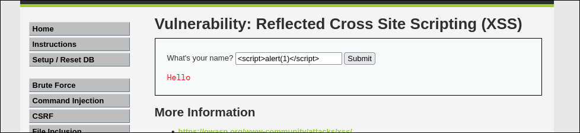

> You might have heard this advice in the cyber security field, "build your own custom home lab". Today we will explore how to build one.

## Setting up victim server with MySQL and DVWA

We will be setting up DVWA in a Debian-based linux distribution (Ubuntu 22.04). This application has dependencies like MySQL, PHP and Apache web server. We will set up those first.

1. Install all of them with the following command

```
$ sudo apt update
$ sudo apt install apache2 mariadb-server php php-mysqli php-gd libapache2-mod-php
```

2. Next, enter this command. This is a wrapper for setting up the database and users:

```
$ sudo mysql_secure_installation
```

3. Type `yes` and create a user and set its privileges.

```sql
CREATE USER 'dvwa'@'localhost' IDENTIFIED BY 'password';
GRANT ALL PRIVILEGES ON dvwa.* TO 'dvwa'@'localhost' IDENTIFIED BY 'password';
```

4. Next we install DVWA using the Github repo:

```
$ cd /var/www/html
$ sudo git clone https://github.com/digininja/DVWA.git
[...]
$ sudo chown -R www-data:www-data /var/www/html/*
```

5. Now we configure DVWA so that the application can communicate with the database. Go to `/var/www/html` directory and enter the following command to rename `config.inc.php.dist` to `config.inc.php`.

```
$ cd /var/www/html/DVWA/config
$ cp config.inc.php.dist config.inc.php
```

6. Update the database information under the `config.inc.php` file. Change the `db_user` to `dvwa` and `db_password` to `password`.

7. Start the `mysql` service.

```
$ sudo systemctl start mysql
```

8. Update the php file and go to `/etc/php/x.x/apache2/` to open the `php.ini` file.
9. Search for `allow_url_include` and set to On.
10. Start the apache service using the following:
```
$ sudo systemctl start apache2
```

11. Open DVWA at [this](http://localhost/DVWA/setup.php) location and reset the database.
12. Login with the default credentials `admin:password` and you are done!

This completes the DVWA installation. Now we can test for vulnerabilities.

Wazuh installation is very well documented in the Wazuh docs. Check them [here](https://documentation.wazuh.com/current/index.html).

## Testing for a SQL Injection attack

> [!NOTE]
> Before testing for web vulnerabilities, we need to change the config file for Wazuh agent to ingest apache logs. It is done by adding the following text at the end of `/var/ossec/etc/ossec.conf` file inside `ossec_config` block:
> ```xml
> <localfile>
>   <log_format>apache</log_format>
>   <location>/var/log/apache2/access.log</location>
> </localfile>
> 
> <localfile>
>   <log_format>apache</log_format>
>   <location>/var/log/apache2/error.log</location>
> </localfile>
> ```
> Then restart the Wazuh agent using this: `sudo systemctl reload wazuh-agent`

Navigating to the SQL Injection in the DVWA application, we enter the following payload:

```sql
' OR 1 = 1 --
```



We see the payload works. Let check the Wazuh logs to verify that it actually fired an alert.



And it did! So our SIEM solution works.

More articles on this coming soon!

<!-- ## Testing for Reflected XSS attack



If you click Submit, the log is not shown in Wazuh (as was shown for SQL Injection). What we can do is, we can manually create a rule for it to detect XSS attacks. -->
